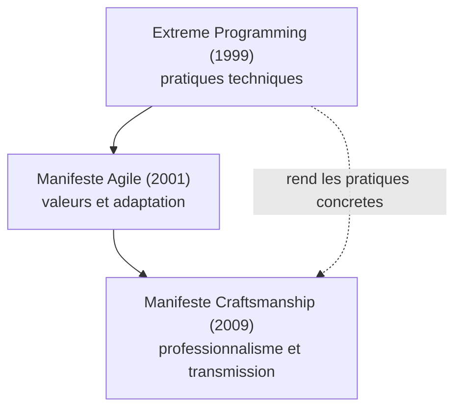
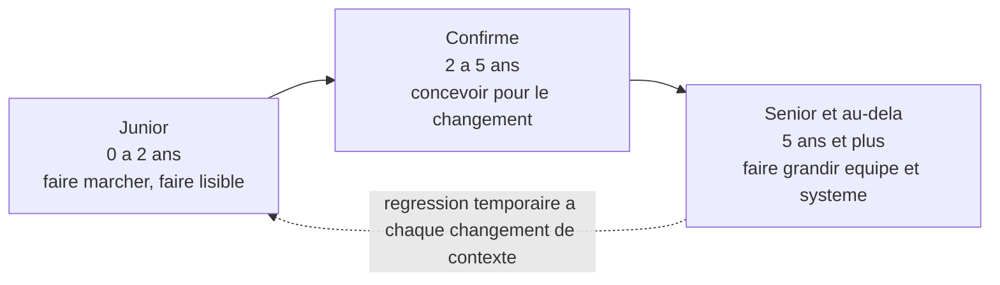
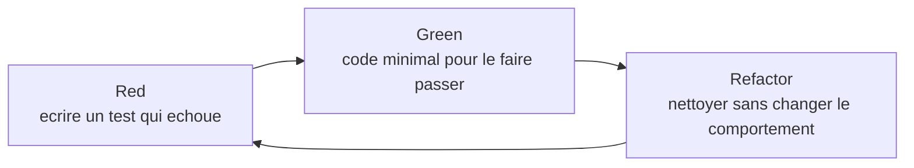
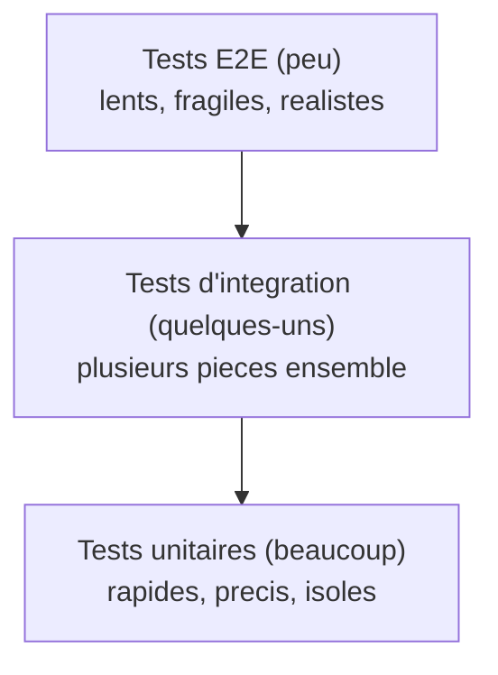
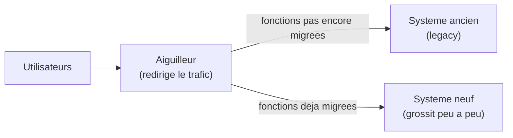
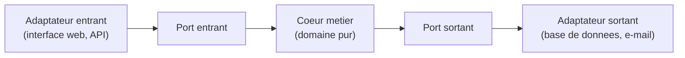
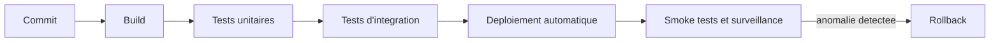

# Guide de progression vers le Software Craftsmanship

[](LICENSE) [](#) [](#) [](https://www.markdownguide.org/)

Le *Software Craftsmanship* (en français : artisanat du logiciel) désigne une posture professionnelle plutôt qu'une méthode.

> **Que veut dire « Software Craftsmanship » ?**
> *Software* signifie « logiciel ». *Craftsmanship* vient de *craft*, le métier manuel, l'artisanat. Un *craftsman* est un artisan : la personne qui connaît son métier au point de signer son travail sans rougir. Comparaison du quotidien : un bon menuisier ne se contente pas qu'une étagère tienne au mur ; il soigne aussi les coupes invisibles à l'arrière, parce que c'est ainsi qu'on reconnaît le travail bien fait. L'artisan du logiciel applique la même exigence au code que personne ne verra directement.

Cette posture a été formalisée par le [Manifesto for Software Craftsmanship](https://manifesto.softwarecraftsmanship.org/) (2009). Elle tient en trois engagements : tendre vers la maîtrise, livrer du logiciel qu'on est fier de signer, transmettre son savoir aux autres.

Le parcours se découpe en étapes, chacune centrée sur une dimension précise. Elles se suivent dans l'ordre ou se piochent selon le contexte. Comptez plusieurs mois par étape pour lire, pratiquer, intégrer, car une compétence technique ne s'acquiert pas par la seule lecture : elle se grave par la répétition.

Les exercices se vivent en équipe, en *coding dojo* (séance d'entraînement collective, définie plus bas) ou en mob (programmation en groupe). Le texte qui suit pose le décor et donne le vocabulaire.

## Table des matières

- [Glossaire de référence](#glossaire-de-référence)
- [Le Manifeste du Software Craftsmanship](#le-manifeste-du-software-craftsmanship)
- [Les racines XP : d'où vient le craft](#les-racines-xp--doù-vient-le-craft)
- [Parcours junior, confirmé, senior](#parcours-junior-confirmé-senior)
- [1. Fondamentaux du développement](#1-fondamentaux-du-développement)
- [2. Qualité du code et tests](#2-qualité-du-code-et-tests)
- [3. Conception et architecture](#3-conception-et-architecture)
- [4. Livraison et exploitation (DevOps)](#4-livraison-et-exploitation-devops)
- [Test-Driven Development en profondeur](#test-driven-development-en-profondeur)
- [Le côté sombre du TDD : sur-tester et abîmer la conception](#le-côté-sombre-du-tdd--sur-tester-et-abîmer-la-conception)
- [Catalogue de refactorings essentiels](#catalogue-de-refactorings-essentiels)
- [Katas recommandés par difficulté](#katas-recommandés-par-difficulté)
- [Du kata d'exhibition à la pratique quotidienne](#du-kata-dexhibition-à-la-pratique-quotidienne)
- [Pair programming et mob programming](#pair-programming-et-mob-programming)
- [Quand pairer, quand ne pas pairer](#quand-pairer-quand-ne-pas-pairer)
- [La revue de code (code review) bien faite](#la-revue-de-code-code-review-bien-faite)
- [L'estimation honnête : story points, T-shirt, NoEstimates](#lestimation-honnête--story-points-t-shirt-noestimates)
- [Travailler avec du code legacy](#travailler-avec-du-code-legacy)
- [Petits pas en territoire legacy : éviter la paralysie d'analyse](#petits-pas-en-territoire-legacy--éviter-la-paralysie-danalyse)
- [Continuous Delivery comme aboutissement du craft](#continuous-delivery-comme-aboutissement-du-craft)
- [Mentorat : enseigner est un métier en soi](#mentorat--enseigner-est-un-métier-en-soi)
- [Évolution de carrière du craftsman](#évolution-de-carrière-du-craftsman)
- [Burnout et perfectionnisme du craftsman](#burnout-et-perfectionnisme-du-craftsman)
- [Communautés et événements](#communautés-et-événements)
- [Anti-patterns du faux craft](#anti-patterns-du-faux-craft)
- [Habitudes du quotidien](#habitudes-du-quotidien)
- [Pour aller plus loin](#pour-aller-plus-loin)

## Glossaire de référence

Le craft a son vocabulaire. Cette section sert de point d'ancrage : on peut y revenir dès qu'un terme rencontré plus loin reste flou. Chaque sigle est développé puis traduit.

- **TDD** (*Test-Driven Development*, développement piloté par les tests) : on écrit d'abord un test qui échoue, puis le code minimal pour le faire passer, puis on refactorise. Cycle red-green-refactor.
- **BDD** (*Behavior-Driven Development*, développement piloté par le comportement) : variante du TDD où les tests sont exprimés en langage naturel (Given / When / Then) pour rester proches du métier. Outils typiques : Cucumber, SpecFlow, Behat.
- **Refactoring** (refactorisation) : modifier la structure interne du code sans changer son comportement observable. Toujours sous filet de sécurité de tests.
- **Code review** (revue de code) : relecture d'un changement par un autre développeur avant intégration, sur une *Pull Request* ou *Merge Request*.
- **Pair programming** (programmation en binôme) : deux développeurs, un clavier, deux rôles (driver / navigator) qui s'échangent régulièrement.
- **Mob programming** (programmation en groupe) : la même chose à trois, quatre, cinq personnes ou plus. Une seule machine, le savoir circule.
- **Kata** : exercice de programmation court, répétable, dont l'enjeu n'est pas le résultat mais la *manière* de l'atteindre. Inspiré des arts martiaux japonais.
- **Dojo** (*coding dojo*) : séance collective où l'on pratique un kata ensemble, généralement en TDD strict, en pair ou en mob.
- **Rétro** (*retrospective*, rétrospective) : réunion de fin d'itération pour inspecter ce qui a marché, ce qui n'a pas marché, et décider d'une action d'amélioration.
- **Kaizen** (改善) : terme japonais désignant l'amélioration continue par petits pas. La rétro en est l'instrument.
- **Dette technique** (*technical debt*) : raccourci pris dans le code ou la conception qui facilite la livraison aujourd'hui mais coûte demain. Métaphore de Ward Cunningham (1992).
- **Definition of Done** (DoD, définition de fini) : liste de critères qu'une tâche doit satisfaire pour être considérée comme terminée. Tests verts, revue passée, documentation à jour, déployé, etc.
- **Story point** : unité d'estimation relative d'effort, de complexité et de risque. Pas une unité de temps. Sert à comparer des tâches entre elles, pas à promettre une date.
- **PR / MR** (*Pull Request* / *Merge Request*) : demande d'intégrer une branche dans une autre, ouverte sur la forge (GitHub utilise PR, GitLab utilise MR). Support de la revue de code.
- **CI** (*Continuous Integration*, intégration continue) : pratique consistant à fusionner et tester son travail dans le tronc commun plusieurs fois par jour, automatiquement.
- **CD** (*Continuous Delivery*, livraison continue) : prolongement de la CI où chaque commit produit un artefact déployable à tout moment. *Continuous Deployment* va plus loin : chaque commit qui passe la CI est automatiquement mis en production.
- **YAGNI** (*You Aren't Gonna Need It*) : ne pas implémenter ce qui n'est pas demandé maintenant.
- **DRY** (*Don't Repeat Yourself*) : chaque connaissance doit avoir une représentation unique, faisant autorité, dans le système.
- **KISS** (*Keep It Simple, Stupid*) : préférer la solution simple à la solution clever.
- **SOLID** : cinq principes de conception objet (Single responsibility, Open/closed, Liskov substitution, Interface segregation, Dependency inversion).
- **Code smell** (mauvaise odeur du code) : symptôme qui suggère un problème de conception sans le prouver. Inventaire chez Fowler.
- **Bounded context** (contexte délimité) : frontière à l'intérieur de laquelle un modèle de domaine a un sens cohérent et un vocabulaire stable. Concept central du DDD.
- **ADR** (*Architecture Decision Record*) : court document daté qui consigne une décision d'architecture, son contexte et ses conséquences.
- **XP** (*Extreme Programming*, programmation extrême) : méthode introduite par Kent Beck en 1999 dans *Extreme Programming Explained*. Pousse à l'extrême un faisceau de pratiques techniques (TDD, pair, refactoring, intégration continue, design simple, *small releases*). Parent direct du craftsmanship.
- **TDD-induced design damage** : expression de David Heinemeier Hansson (DHH, 2014) pour désigner les distorsions de conception introduites lorsqu'on optimise le code uniquement pour qu'il soit testable (multiplication des indirections, services anémiques, abus de mocks).
- **Test smell** (mauvaise odeur de test) : symptôme dans la suite de tests elle-même (test fragile, test obscur, test redondant, *mystery guest*). Catalogue chez Meszaros, *xUnit Test Patterns*.
- **NoEstimates** : mouvement initié par Vasco Duarte et Woody Zuill (2012-2014) qui propose de remplacer l'estimation par le découpage régulier en petites tranches livrables et la mesure du *throughput*.
- **Story point** déjà défini plus haut ; voir aussi *T-shirt sizing* (XS, S, M, L, XL) qui exprime le même esprit relatif sans chiffres.
- **Throughput** : nombre de tickets terminés par unité de temps. Métrique de flux préférée par les tenants du *NoEstimates*.
- **Mikado method** : technique de Daniel Brolund et Ola Ellnestam (*The Mikado Method*, 2014) pour mener un changement complexe par exploration et *backtracking*, en gardant le code compilable à chaque étape.
- **Tidy First** : terme de Kent Beck (*Tidy First?*, 2023) pour les micro-rangements préparatoires qu'on commit séparément avant un changement de comportement.
- **Strangler Fig** : voir section legacy. Patron de migration progressive popularisé par Martin Fowler en 2004.
- **Anti-corruption layer** : couche de traduction entre deux modèles, concept du DDD. Empêche les concepts d'un modèle pourri de polluer un modèle propre.
- **AABBCC** : grille mnémotechnique de revue de code (*Architecture, API, Bugs, Behaviour, Clarity, Coverage*). Voir section dédiée.
- **DORA** (*DevOps Research and Assessment*) : équipe de recherche dirigée par Nicole Forsgren, à l'origine des quatre métriques clés (*lead time*, *deployment frequency*, *MTTR*, *change failure rate*) et du rapport annuel *State of DevOps*.
- **DX** (*Developer Experience*, expérience développeur) : qualité ressentie du quotidien par celles et ceux qui produisent le logiciel. Indicateur indirect mais sérieux de la santé craft d'une organisation.

## Le Manifeste du Software Craftsmanship

Publié en 2009 par Robert C. Martin et un groupe de praticiens, le [Manifeste pour le Software Craftsmanship](https://manifesto.softwarecraftsmanship.org/) reprend la forme du [Manifeste Agile](https://agilemanifesto.org/iso/fr/manifesto.html) (2001) en lui ajoutant un quatrième niveau d'exigence.

> En tant qu'aspirants Software Craftsmen, nous augmentons la barre du développement professionnel de logiciel en pratiquant et en aidant les autres à apprendre le métier. À travers ce travail, nous en sommes venus à valoriser :
>
> Non seulement des logiciels qui fonctionnent, **mais aussi des logiciels bien conçus**.
> Non seulement l'adaptation aux changements, **mais aussi l'enrichissement constant de la valeur**.
> Non seulement les individus et leurs interactions, **mais aussi une communauté de professionnels**.
> Non seulement la collaboration avec le client, **mais aussi des partenariats productifs**.
>
> Ainsi, en recherchant les éléments de gauche, nous avons trouvé que ceux de droite sont indispensables.

> **Que veut dire « agile » et « Manifeste Agile » ?**
> L'agilité est une famille de méthodes de travail apparue dans les années 1990 et 2000, qui privilégie les petites livraisons fréquentes et l'adaptation au changement plutôt que les gros plans figés d'avance. Le Manifeste Agile (2001) en est le texte fondateur : quatre valeurs courtes signées par dix-sept praticiens. Comparaison du quotidien : préparer un repas en goûtant et corrigeant au fur et à mesure (agile), plutôt que suivre une recette à la lettre sans jamais goûter (méthode rigide).

**À retenir.** Le manifeste agile reste valable ; le craftsmanship en est une extension. Là où l'agile met l'accent sur la livraison de valeur et l'adaptation, le craft insiste sur la **manière** de livrer cette valeur : un code bien conçu, une communauté qui se forme, des partenariats au-delà de la transaction. Le craftsman ne s'oppose pas à l'agiliste, il refuse simplement le compromis « ça marche, tant pis pour le code », parce qu'un logiciel mal conçu coûte cher à chaque modification future.

**Différence clé avec l'Agile Manifesto.** Le Manifeste Agile parle d'efficacité et d'humain dans la livraison. Le Manifeste Craftsmanship parle du **professionnalisme du producteur** : qualité intrinsèque, transmission, durabilité. Les deux sont complémentaires, comme le montre leur filiation :



## Les racines XP : d'où vient le craft

Le craftsmanship n'est pas tombé du ciel en 2009. Il est l'enfant direct de l'**Extreme Programming** formalisé par Kent Beck en 1999 (*Extreme Programming Explained: Embrace Change*). XP a posé, avant tous les autres, l'idée qu'un faisceau de **pratiques techniques** (TDD, pair, refactoring, intégration continue, design simple, *small releases*, propriété collective du code) tient la qualité d'un logiciel autant que la posture humaine.

> **Que veulent dire « Scrum », « sprint », « daily stand-up » ?**
> Ce sont des rituels d'organisation venus de l'agilité. **Scrum** est la méthode agile la plus répandue : elle organise le travail en cycles courts. **Sprint** désigne l'un de ces cycles, en général deux semaines, à l'issue duquel l'équipe livre quelque chose d'utilisable. **Daily stand-up** (réunion debout quotidienne) est une réunion de quelques minutes, faite debout pour qu'elle reste courte, où chacun dit ce qu'il a fait, ce qu'il va faire et ce qui le bloque. Ces rituels organisent **quand** on travaille, pas **comment** on écrit le code.

Le Manifeste Agile (2001) a abstrait ce faisceau en valeurs et principes plus universels, plus communicables aux managers. La conséquence non voulue : la diffusion de l'agile a pu se faire **sans les pratiques techniques**. Beaucoup d'organisations « agiles » au sens des cérémonies (Scrum, sprints, *daily stand-up*) n'ont jamais adopté TDD, refactoring outillé ni livraison continue. C'est précisément ce vide que le manifeste de 2009 a voulu combler, car des rituels sans qualité technique produisent du logiciel livré vite mais difficile à faire évoluer.

**Lectures pour situer XP.**

- Kent Beck, *Extreme Programming Explained: Embrace Change* (1999, 2e édition 2004). Court, lumineux, encore actuel.
- Ron Jeffries, Ann Anderson, Chet Hendrickson, *Extreme Programming Installed* (2000). Le quotidien d'une équipe XP.
- Robert C. Martin, *Agile Software Development: Principles, Patterns, and Practices* (2002). La synthèse SOLID à la sortie d'XP.

À retenir : si quelqu'un présente le craft comme une mode récente, le sommaire d'*Extreme Programming Explained* suffit à le démentir. La majorité des pratiques décrites ici y figurent déjà. Le craftsmanship a, en plus, ajouté la **dimension communautaire** (apprentissage entre pairs, transmission, mouvement) qu'XP avait laissée à l'état d'usage local.

## Parcours junior, confirmé, senior

Un parcours réaliste s'étale sur plusieurs années, avec des paliers identifiables. Voici une cartographie indicative ; les durées varient selon le contexte, l'environnement et l'investissement personnel.



### Junior (0 à 2 ans)

**Mantra** : « je fais marcher, je fais lisible, je demande quand je bloque. »

- Lectures pivots : *The Pragmatic Programmer*, *Clean Code*.
- Pratiques : nommage soigné, fonctions courtes, tests unitaires sur du code neuf, premières revues de code à recevoir et à donner.
> **Que veulent dire « IDE » et « Git » ?**
> Un **IDE** (*Integrated Development Environment*, environnement de développement intégré) est le logiciel dans lequel on écrit le code : il combine un éditeur de texte, des outils pour exécuter et corriger le programme, et de l'assistance automatique (renommage, complétion). Exemples : IntelliJ IDEA, Visual Studio Code, PhpStorm. **Git** est un outil de gestion de versions : il enregistre l'historique de toutes les modifications du code, permet de revenir en arrière et de travailler à plusieurs sans s'écraser mutuellement. Comparaison du quotidien : Git est l'historique de modifications d'un document partagé, mais en beaucoup plus précis et fiable.

- Outils : maîtriser un IDE, Git en ligne de commande, un langage à fond plutôt que cinq survolés.
- Indicateurs de progression : vos PR passent la revue avec peu de remarques, vous savez expliquer un bug avant de le corriger.

### Confirmé (2 à 5 ans)

**Mantra** : « je conçois pour le changement, je teste avant, je laisse le code meilleur que je l'ai trouvé. »

- Lectures pivots : *Refactoring* (Fowler), *Working Effectively with Legacy Code* (Feathers), *Growing Object-Oriented Software* (Freeman & Pryce), *The Clean Coder*.
- Pratiques : TDD au quotidien, refactoring outillé, pair / mob, animation de katas internes, contribution à des décisions d'architecture documentées (ADR).
- Frontière typique : on devient *aller-chercheur* d'information sur un sujet flou, plutôt que d'attendre une spécification claire.
- Indicateurs : on vous confie la reprise de modules anciens, vous formulez des refus argumentés, vos estimations s'affinent.

### Senior et au-delà (5 ans et plus)

**Mantra** : « je fais grandir l'équipe et le système ; mon impact se mesure à ce qui tient sans moi. »

- Lectures pivots : *Domain-Driven Design* (Evans), *Implementing DDD* (Vernon), *Clean Architecture* (Martin), *Designing Data-Intensive Applications* (Kleppmann), *Accelerate* (Forsgren et al.), *Software Craftsmanship* (Mancuso), *Team Topologies* (Skelton & Pais).
- Pratiques : conception de systèmes, mentorat, animation de communautés, contribution à la stratégie technique, choix de compromis architecturaux assumés.
- Indicateurs : on vous sollicite pour arbitrer entre options techniques, vos écrits font référence dans l'équipe, des juniors progressent visiblement à votre contact.

> **Que veut dire « stack » ?**
> Une *stack* (pile technologique) est l'ensemble des technologies utilisées pour construire une application : le langage de programmation, le cadre logiciel (*framework*), la base de données, les outils. Comparaison du quotidien : un cuisinier maîtrise des ustensiles et des techniques précis ; changer de cuisine (française vers japonaise) le force à réapprendre des gestes, même s'il reste un bon cuisinier.

Le passage d'un palier à l'autre n'est pas linéaire. On régresse temporairement chaque fois qu'on change de stack, de domaine ou de contexte. C'est normal : les réflexes acquis sont liés à un environnement précis et doivent être reconstruits ailleurs.

### Honnêteté sur la progression : tout le monde n'est pas staff

> **Que veulent dire « staff », « principal », « distinguished » ?**
> Ce sont des titres de carrière d'ingénieur au-delà de « senior », pour celles et ceux qui veulent prendre plus de responsabilité technique sans devenir managers (encadrants de personnes). Du plus accessible au plus rare : **staff engineer** (impact sur plusieurs équipes), **principal engineer** (impact à l'échelle de l'entreprise), **distinguished engineer** (figure de référence, très rare). Comparaison du quotidien : ce sont des grades, comme les ceintures en arts martiaux, mais le grade ne garantit pas la maîtrise réelle.

L'industrie parle beaucoup des trajectoires *staff / principal / distinguished*. Elles existent, elles sont légitimes, et elles attirent les projecteurs. Mais elles ne sont **ni le seul horizon, ni le plus enviable**.

Beaucoup d'excellents praticiens **restent toute leur carrière à un niveau « senior »** au sens technique, par choix lucide. Ils approfondissent un domaine (paiement, télémétrie, compilateurs, données géographiques) et deviennent la mémoire et la maîtrise d'une équipe ou d'un produit. Leur impact se mesure à la **profondeur**, pas à la largeur. C'est une voie pleinement craft : Sandi Metz a écrit l'essentiel de son œuvre en restant développeuse senior ; Emily Bache enseigne le TDD sans être *staff* d'aucune mégastructure ; Michael Feathers a façonné notre rapport au legacy sans titre nobiliaire technique.

> **Que veut dire « flow » ?**
> Le *flow* (état de flux) est l'état de concentration profonde où l'on est absorbé par une tâche, productif et sans distraction. Le psychologue Mihály Csíkszentmihályi l'a décrit. Comparaison du quotidien : le moment où l'on est tellement plongé dans un livre passionnant qu'on oublie l'heure. Les réunions fréquentes cassent cet état, qui demande de longues plages ininterrompues pour s'installer.

L'erreur courante chez les *staff aspirants* : croire que monter d'un titre, c'est gagner en sens. Souvent, c'est gagner en réunions et perdre en *flow*. Le bon repère :

- **Ce qui me rend le plus utile aujourd'hui à mon équipe et à mon produit, est-ce d'écrire du code, de mentorer, d'arbitrer, d'animer une communauté ?** La réponse honnête vous dit votre prochaine marche, indépendamment de la grille de l'entreprise.
- **Une trajectoire latérale (autre domaine, autre contexte) vaut souvent une trajectoire ascendante.** Le craftsman qui passe d'un éditeur de logiciel à une administration publique, ou d'un grand groupe à une coopérative, apprend autant qu'un changement de titre.
- **Un titre supérieur sans la maîtrise associée est une promesse non tenue.** Le « senior à 18 mois » et le « staff par négociation » sont des versions du même piège. Mieux vaut être un excellent senior qu'un staff d'apparence.

Cette honnêteté est rare dans la littérature carrière. Elle est pourtant au cœur du craft : on cherche la maîtrise, pas le titre.

## 1. Fondamentaux du développement

**Objectif** : disposer d'un socle solide en pratiques pragmatiques, lisibilité du code et professionnalisme.

> **Que veut dire « heuristique » ?**
> Une heuristique est une règle pratique, pas une loi absolue : un raccourci de bon sens qui marche dans la plupart des cas, sans garantie parfaite. Comparaison du quotidien : « si le ciel est gris le matin, prends un parapluie ». Ce n'est pas toujours vrai, mais c'est un bon réflexe. La plupart des conseils de ce texte sont des heuristiques, pas des dogmes.

### Livres : fondamentaux

1. **[The Pragmatic Programmer: From Journeyman to Master](https://www.amazon.fr/Pragmatic-Programmer-Journeyman-Master/dp/020161622X)**, Andrew Hunt, David Thomas
   La référence sur les bonnes pratiques transverses : DRY, orthogonalité, programmation défensive, automatisation. La 20e édition anniversaire (2019) modernise les exemples.

   > **Que veulent dire « DRY », « orthogonalité », « programmation défensive » ?**
   > **DRY** (*Don't Repeat Yourself*, ne vous répétez pas) : chaque information ou règle ne doit exister qu'à un seul endroit du code, sinon une modification oblige à corriger plusieurs copies et on en oublie toujours une. **Orthogonalité** : organiser le code en parties indépendantes qui ne se gênent pas, de sorte que modifier l'une ne casse pas les autres. Comparaison du quotidien : les boutons d'une télécommande sont orthogonaux : changer le volume n'éteint pas la télévision. **Programmation défensive** : écrire du code qui se méfie des données reçues (vérifier qu'une valeur n'est pas absente, qu'un nombre n'est pas négatif) pour éviter qu'une erreur lointaine ne fasse tout planter.

2. **[Clean Code: A Handbook of Agile Software Craftsmanship](https://www.amazon.fr/Clean-Code-Handbook-Software-Craftsmanship/dp/0132350882)**, Robert C. Martin
   Heuristiques concrètes pour écrire du code lisible : nommage, fonctions courtes, commentaires utiles, gestion des erreurs.

3. **[The Clean Coder: A Code of Conduct for Professional Programmers](https://www.amazon.fr/Clean-Coder-Conduct-Professional-Programmers/dp/0137081073)**, Robert C. Martin
   La face professionnelle du métier : engagements, estimations, refus quand c'est nécessaire, gestion du temps et de la pression.

4. **[Software Craftsmanship: Professionalism, Pragmatism, Pride](https://www.amazon.fr/Software-Craftsmanship-Professionalism-Pragmatism-Pride/dp/0134052501)**, Sandro Mancuso
   Sandro Mancuso, fondateur de la London Software Craftsmanship Community, raconte le mouvement de l'intérieur : ce que signifie le craft, comment il se transmet, comment il s'incarne en entreprise.

### Pratique : fondamentaux

- **[Exercism](https://exercism.io/)** : exercices avec retour de mentors humains, plus de 60 langages.
- **[Codewars](https://www.codewars.com/)** : *katas* à classement, utiles pour explorer un nouveau langage rapidement.
- **Tenir un journal d'apprentissage** : quelques lignes par semaine sur ce que vous avez appris ; le cumul fait la différence.
- **Lire au moins un livre du bloc fondamentaux par trimestre**, plume à la main.

### Au sortir de l'étape Fondamentaux, vous savez

- nommer, structurer et formater un fichier de manière à ne pas faire perdre de temps au prochain lecteur ;
- repérer les *code smells* fréquents et les corriger ;
- distinguer ce qui relève de la technique pure de ce qui relève du professionnalisme.

## 2. Qualité du code et tests

**Objectif** : développer guidé par les tests, refactorer en confiance, intervenir sur du code legacy sans le casser.

### Livres : qualité et tests

1. **[Growing Object-Oriented Software, Guided by Tests](https://www.amazon.fr/Growing-Object-Oriented-Software-Guided-Tests/dp/0321503627)**, Steve Freeman, Nat Pryce
   *La* référence sur le TDD outside-in et la conception orientée objet pilotée par les tests.

   > **Que veulent dire « TDD outside-in » et « orienté objet » ?**
   > **TDD outside-in** (de l'extérieur vers l'intérieur) : on commence par écrire le test du comportement visible par l'utilisateur, puis on descend progressivement vers les détails internes, en laissant les tests guider la découpe. **Orienté objet** : un style de programmation où l'on regroupe les données et les actions qui les concernent dans des « objets » (par exemple un objet *Commande* qui sait calculer son total). Comparaison du quotidien : plutôt qu'une grosse liste d'instructions, on organise le programme comme une équipe d'employés ayant chacun un rôle clair.

2. **[Refactoring: Improving the Design of Existing Code (2nd ed.)](https://www.amazon.fr/Refactoring-Improving-Design-Existing-Code/dp/0134757599)**, Martin Fowler
   Catalogue de refactorings nommés, avec mécanique pas à pas. Édition 2018 en JavaScript.

3. **[Working Effectively with Legacy Code](https://www.amazon.fr/Working-Effectively-Legacy-Code-Feathers/dp/0131177052)**, Michael Feathers
   Comment introduire des tests sur du code qui n'en a jamais eu, technique des *seams*, refactorings sûrs.

4. **[Test Driven Development: By Example](https://www.amazon.fr/Test-Driven-Development-Kent-Beck/dp/0321146530)**, Kent Beck
   Le livre fondateur du TDD, court et démonstratif, par l'inventeur de la pratique.

5. **[xUnit Test Patterns: Refactoring Test Code](https://www.amazon.fr/xUnit-Test-Patterns-Refactoring-Code/dp/0131495054)**, Gerard Meszaros
   Le catalogue des *test smells* et des patrons de tests propres : *fixtures*, *test doubles*, *fragile tests*.

   > **Que veulent dire « fixtures » et « test doubles » ?**
   > Une **fixture** est le décor d'un test : les données et objets préparés avant de lancer la vérification (par exemple un client fictif avec un panier rempli). Un **test double** (doublure de test) est un faux objet qui remplace une vraie dépendance pendant le test, comme une doublure remplace un acteur pour une cascade. On l'utilise quand la vraie chose est lente, coûteuse ou imprévisible (une vraie base de données, un vrai paiement bancaire). Les mocks, vus plus loin, sont une sorte de doublure.

### Pratique : qualité et tests

- **[Coding Dojo](https://codingdojo.org/)** : résoudre un problème à plusieurs en TDD strict.
- **Katas classiques** : Bowling Game, Roman Numerals, Gilded Rose, Tennis Refactoring (voir la section dédiée plus bas).
- **Mob / pair programming** régulier sur du code de production.
- **Mesurer** la couverture de tests d'un projet réel et identifier les zones aveugles.

### Au sortir de l'étape Qualité et tests, vous savez

- écrire un test avant le code de production, quel que soit le contexte ;
- refactorer une fonction de 200 lignes sans la casser ;
- ajouter une fonctionnalité à un module non testé sans le réécrire de zéro.

## 3. Conception et architecture

**Objectif** : structurer un système au-delà de la classe ou du module, comprendre les compromis architecturaux et les frontières de domaine.

### Livres : conception et architecture

1. **[Domain-Driven Design: Tackling Complexity in the Heart of Software](https://www.amazon.fr/Domain-Driven-Design-Complexity-Software/dp/0321125215)**, Eric Evans (« livre rouge »)
   Le fondateur du DDD : langage ubiquitaire, *bounded contexts*, modélisation tactique et stratégique.

   > **Que veut dire « DDD » et « langage ubiquitaire » ?**
   > **DDD** (*Domain-Driven Design*, conception pilotée par le domaine) est une manière de concevoir un logiciel en partant du métier qu'il sert (le « domaine ») plutôt que de la technique. On modélise le code avec les mêmes mots que les experts métier. Le **langage ubiquitaire** est justement ce vocabulaire commun, partagé par les développeurs et les experts du domaine, utilisé à la fois dans les discussions et dans le code. Comparaison du quotidien : si une banque parle de « découvert autorisé », le code doit contenir un concept nommé `DecouvertAutorise`, pas un vague `limite2`. Ainsi tout le monde se comprend.

2. **[Implementing Domain-Driven Design](https://www.amazon.fr/Implementing-Domain-Driven-Design-Vaughn-Vernon/dp/0321834577)**, Vaughn Vernon (« livre jaune »)
   Le pendant pratique d'Evans, avec du code et des recettes.

3. **[Clean Architecture: A Craftsman's Guide to Software Structure and Design](https://www.amazon.fr/Clean-Architecture-Craftsmans-Software-Structure/dp/0134494164)**, Robert C. Martin
   Synthèse des principes de découplage : SOLID, frontières, indépendance vis-à-vis du framework et de la base de données.

   > **Que veut dire « SOLID » ?**
   > SOLID est un moyen mnémotechnique pour cinq principes de conception orientée objet, formulés par Robert C. Martin. Chacun limite les dégâts d'une future modification.
   > - **S**, *Single Responsibility* (responsabilité unique) : une classe ne fait qu'une seule chose, pour une seule raison de changer.
   > - **O**, *Open/Closed* (ouvert/fermé) : on peut ajouter un comportement sans modifier le code existant, en ajoutant du neuf à côté.
   > - **L**, *Liskov Substitution* (substitution de Liskov) : une sous-classe doit pouvoir remplacer sa classe parente sans surprise. Comparaison : un canard en plastique qui « est un canard » mais ne nage pas casse cette règle.
   > - **I**, *Interface Segregation* (ségrégation des interfaces) : mieux vaut plusieurs petits contrats ciblés qu'un gros contrat fourre-tout qui force à implémenter des choses inutiles.
   > - **D**, *Dependency Inversion* (inversion des dépendances) : le code métier important ne dépend pas des détails techniques ; ce sont les détails qui s'adaptent à lui. Approfondi plus loin.

4. **[Designing Data-Intensive Applications](https://www.amazon.fr/Designing-Data-Intensive-Applications-Reliable-Maintainable/dp/1449373321)**, Martin Kleppmann
   Tout ce qu'il faut savoir sur le stockage, la cohérence, la réplication, le streaming et la résilience.

5. **[Building Evolutionary Architectures: Support Constant Change](https://www.amazon.fr/Building-Evolutionary-Architectures-Support-Constant/dp/1491986360)**, Neal Ford, Rebecca Parsons, Patrick Kua
   Architecture conçue pour évoluer, *fitness functions*, tests d'architecture.

6. **[Team Topologies: Organizing Business and Technology Teams for Fast Flow](https://www.amazon.fr/Team-Topologies-Organizing-Business-Technology/dp/1942788819)**, Matthew Skelton, Manuel Pais
   La conception des équipes comme conception du système (loi de Conway prise au sérieux).

   > **Que veut dire « loi de Conway » ?**
   > Énoncée par Melvin Conway en 1968 : un système logiciel finit par ressembler à la structure de communication de l'organisation qui le construit. Comparaison du quotidien : si quatre équipes qui se parlent peu écrivent un compilateur, il aura tendance à se découper en quatre morceaux mal raccordés. La conséquence pratique : pour obtenir une certaine architecture, organisez d'abord les équipes en conséquence.

### Pratique : conception et architecture

- **[System Design Primer](https://github.com/donnemartin/system-design-primer)** : exercices de conception de systèmes à grande échelle.
- **Lire l'architecture** de projets open-source dans son langage de prédilection.
- **Documenter** les décisions structurantes via des [ADR](https://adr.github.io/) (*Architecture Decision Records*).
- **Animer un Event Storming** sur un domaine que vous connaissez.

> **Que veut dire « Event Storming » ?**
> L'*Event Storming* (tempête d'événements) est un atelier collaboratif inventé par Alberto Brandolini : on réunit développeurs et experts métier devant un grand mur, et chacun colle des notes adhésives représentant les événements importants du métier (« commande payée », « colis expédié »), dans l'ordre, pour découvrir ensemble comment le domaine fonctionne réellement. Comparaison du quotidien : reconstituer collectivement le déroulé d'un mariage en plaçant les étapes sur une frise, pour repérer qui fait quoi et quand.

### Au sortir de l'étape Conception et architecture, vous savez

- découper un système en *bounded contexts* qui correspondent au métier ;
- choisir entre monolithe modulaire et microservices avec des arguments concrets ;
- justifier vos décisions architecturales par écrit, en explicitant les compromis.

## 4. Livraison et exploitation (DevOps)

**Objectif** : porter la qualité jusqu'en production, livrer souvent, observer ce qui tourne.

> **Que veulent dire « production », « DevOps », « pipeline » ?**
> La **production** (souvent « la prod ») est l'environnement réel où tourne le logiciel utilisé par les vraies personnes, par opposition aux environnements de test. Une erreur en production touche des utilisateurs réels. **DevOps** est la contraction de *Development* (développement) et *Operations* (exploitation, c'est-à-dire faire tourner et surveiller les serveurs) : un mouvement qui réunit ces deux métiers longtemps séparés, pour que ceux qui écrivent le code participent aussi à sa mise en service. Un **pipeline** (chaîne de traitement) est la suite automatisée d'étapes par lesquelles passe chaque modification : compilation, tests, puis déploiement. Comparaison du quotidien : une chaîne de montage où le code avance d'un poste à l'autre, chaque poste vérifiant quelque chose avant de laisser passer.

### Livres : livraison et exploitation

1. **[The Phoenix Project: A Novel About IT, DevOps, and Helping Your Business Win](https://www.amazon.fr/Phoenix-Project-DevOps-Helping-Business/dp/1942788290)**, Gene Kim, Kevin Behr, George Spafford
   Roman pédagogique qui fait comprendre les *Three Ways* du DevOps par l'histoire d'une équipe en crise.

2. **[Accelerate: The Science of Lean Software and DevOps](https://www.amazon.fr/Accelerate-Software-Performing-Technology-Organizations/dp/1942788339)**, Nicole Forsgren, Jez Humble, Gene Kim
   Synthèse des recherches DORA : les quatre métriques (lead time, deployment frequency, MTTR, change failure rate) et leurs corrélations avec la performance d'entreprise.

3. **[Continuous Delivery: Reliable Software Releases through Build, Test, and Deployment Automation](https://www.amazon.fr/Continuous-Delivery-Reliable-Deployment-Automation/dp/0321601912)**, Jez Humble, David Farley
   Mécanique du *deployment pipeline*, infrastructure as code, gestion des bases de données.

4. **[Site Reliability Engineering](https://sre.google/sre-book/table-of-contents/)**, Google (gratuit en ligne)
   Disponibilité comme produit, SLI / SLO / SLA, *error budgets*, postmortems sans blâme.

   > **Que veulent dire « SRE », « SLI / SLO / SLA » et « postmortem sans blâme » ?**
   > **SRE** (*Site Reliability Engineering*, ingénierie de la fiabilité des sites) est une discipline née chez Google qui traite la fiabilité d'un service comme une fonctionnalité à part entière, avec des mesures et des objectifs chiffrés. Les trois sigles suivants encadrent justement cette fiabilité. **SLI** (*Service Level Indicator*, indicateur de niveau de service) : une mesure concrète, par exemple le pourcentage de requêtes qui répondent en moins d'une seconde. **SLO** (*Service Level Objective*, objectif de niveau de service) : la cible qu'on se fixe sur cet indicateur, par exemple « 99,9 % des requêtes en moins d'une seconde ». **SLA** (*Service Level Agreement*, accord de niveau de service) : l'engagement contractuel envers le client, avec des pénalités s'il n'est pas tenu. Un **postmortem sans blâme** est le compte rendu écrit après un incident, qui cherche les causes du problème dans le système et non un coupable, pour que chacun ose dire la vérité et que l'équipe apprenne réellement.

### Pratique : livraison et exploitation

- **Construire son propre pipeline** sur un side-project : commit → tests → build → déploiement automatique.

> **Que veulent dire « conteneur » et « orchestrateur » (Kubernetes) ?**
> Un **conteneur** est un colis logiciel qui emballe une application avec tout ce dont elle a besoin pour tourner (bibliothèques, configuration), de sorte qu'elle fonctionne à l'identique sur n'importe quelle machine. Comparaison du quotidien : un conteneur maritime standardisé se charge sur n'importe quel bateau ou camion sans souci de son contenu. Un **orchestrateur** comme **Kubernetes** est le chef d'orchestre qui démarre, arrête, répartit et redémarre automatiquement des centaines de ces conteneurs sur un parc de serveurs, sans intervention humaine permanente.

- **[Kubernetes Documentation](https://kubernetes.io/docs/home/)** : l'orchestrateur de fait pour les conteneurs.
- **[The Twelve-Factor App](https://12factor.net/fr/)** : méthodologie pour des applications portables et déployables en continu.
- **Exécuter un *game day*** : couper volontairement un service pour observer la résilience du reste.

### Au sortir de l'étape Livraison et exploitation, vous savez

- mettre en place un pipeline de livraison continue depuis zéro ;
- diagnostiquer un incident en production à partir de logs, métriques et traces ;
- discuter SLO, *error budget* et coût de l'indisponibilité avec un product manager.

## Test-Driven Development en profondeur

Le TDD est plus qu'une technique de test : c'est une **boucle de feedback de conception**. Le test n'est pas la fin ; il est la pression qui pousse vers un code mieux découpé.

> **Avertissement craft.** Le red-green-refactor est un *moyen*, pas une cérémonie. Le but du test n'est ni de vous faire afficher un badge vert, ni de remplir un quota de couverture, ni de ressembler à un kata bien fait. Le but est d'**obtenir un retour rapide et juste** sur la conception et le comportement. Si vous récitez le cycle sans en sentir la pression, c'est du TDD-théâtre.

> **Refactor sous filet, jamais sans.** La phase 3 du cycle suppose que vous avez une suite de tests qui dit la vérité, vite. Sans ce filet, ce que vous appelez « refactoring » est en réalité une **réécriture à risques**. Le craftsman qui modifie une structure sans test fiable au préalable n'est pas en train de refactorer ; il bricole en pariant sur sa mémoire. Si le filet n'existe pas, on commence par le tisser (caractérisation, *seams*, sprout). Ce n'est pas négociable.

### Le cycle red-green-refactor

> **Que veut dire « red-green-refactor » ?**
> C'est le rythme en trois temps du TDD, nommé d'après la couleur qu'affiche l'outil de test. **Red** (rouge) : on écrit d'abord un test, il échoue car le code n'existe pas encore, l'outil affiche rouge. **Green** (vert) : on écrit le minimum de code pour que le test passe, l'outil affiche vert. **Refactor** (refactoriser) : on nettoie le code sans changer ce qu'il fait, en gardant le vert. Comparaison du quotidien : poser d'abord la barre à franchir (rouge), sauter juste assez haut pour la passer (vert), puis soigner son geste (refactor).



1. **Red** : écrire un test qui échoue. Si le test passe du premier coup, c'est qu'il ne testait pas grand-chose.
2. **Green** : écrire le code minimum pour faire passer le test. *Fake it till you make it.* On a le droit d'écrire le code le plus moche possible à cette étape.
3. **Refactor** : nettoyer le code et les tests, **sans ajouter de comportement**. Les tests verts sont le filet.

Trois lois de Robert Martin :
- ne pas écrire de code de production sans test rouge qui l'exige ;
- ne pas écrire plus de test qu'il n'en faut pour échouer (la non-compilation compte) ;
- ne pas écrire plus de code de production qu'il n'en faut pour passer.

### Deux écoles : Chicago (classicist) et London (mockist)

Les deux écoles sont valides. Les connaître permet de faire un choix conscient selon le contexte.

**École classique (dite « Chicago », ou « state-based »).** On part d'un test de bout en bout, on construit les objets réels au fil du test, on vérifie l'état après l'action. Le test connaît peu la structure interne. Refactoriser la structure ne casse pas les tests tant que le comportement public est stable. Référence : Kent Beck, *Test Driven Development: By Example*. Convient aux algorithmes, aux objets-valeurs, aux modèles de domaine purs.

> **Que veulent dire « mock », « objet-valeur », « état » ?**
> Un **mock** (objet simulé) est une doublure de test programmée pour vérifier qu'on l'a bien appelée comme prévu (par exemple : « le service d'envoi d'e-mail a-t-il bien été appelé une fois ? »). Un **objet-valeur** (*value object*) est un petit objet défini uniquement par ses données, sans identité propre, par exemple une somme d'argent ou une adresse e-mail : deux objets identiques sont interchangeables, comme deux pièces de un euro. L'**état** (*state*) est l'ensemble des valeurs que contient un objet à un instant donné ; un test « basé sur l'état » vérifie ces valeurs après l'action, tandis qu'un test « basé sur l'interaction » vérifie quels appels ont eu lieu.

**École londonienne (dite « mockist », ou « interaction-based »).** On part de l'extérieur, on dirige la conception par les collaborations entre objets, on remplace les collaborateurs par des *mocks* qui vérifient les interactions. Référence : Steve Freeman et Nat Pryce, *Growing Object-Oriented Software, Guided by Tests*. Convient aux objets de service, aux orchestrations, aux frontières (HTTP, queues, base de données).

**Comment choisir ?** Pour un cœur de domaine riche et stable, préférer le style Chicago : les tests survivent aux refactos. Pour un service applicatif qui orchestre des collaborateurs, le style Londres documente mieux les contrats. La plupart des codebases mûres mélangent les deux, sans complexe.

### Les tests comme feedback de conception

Si écrire un test est douloureux, le test vous dit quelque chose : trop de dépendances, trop de responsabilités, état caché, couplage. Le réflexe craft : ne pas combattre le test, écouter ce qu'il dénonce et redescendre dans le code.

### Pyramide ou trophée

> **Que veulent dire « test unitaire », « test d'intégration », « E2E » ?**
> Un **test unitaire** vérifie un tout petit morceau de code isolé (une fonction, une classe). Il est rapide et précis. Un **test d'intégration** vérifie que plusieurs morceaux fonctionnent ensemble (par exemple le code et la vraie base de données). Un test **E2E** (*end to end*, de bout en bout) imite un utilisateur réel qui traverse toute l'application, du clic jusqu'au résultat affiché. Comparaison du quotidien : pour une voiture, le test unitaire vérifie une bougie, l'intégration vérifie que le moteur tourne, le E2E vérifie qu'on peut faire le tour du pâté de maisons.

La pyramide classique de Mike Cohn (beaucoup d'unitaires, quelques intégration, peu de bout-en-bout) reste un bon point de départ : les tests rapides et précis sont nombreux, les tests lents et fragiles sont rares.



Pour les applications web modernes, Kent C. Dodds propose le *testing trophy* (statique, unitaire, intégration, E2E) : la couche d'intégration y prend plus d'importance, parce qu'elle attrape les bugs là où les morceaux se rencontrent. Le bon dosage dépend du coût d'exécution et de la fiabilité des tests dans votre contexte. Le critère qui compte : un test qui échoue parle vite, et il parle juste.

## Le côté sombre du TDD : sur-tester et abîmer la conception

Le TDD a aussi ses dérives. Les ignorer, c'est s'exposer à les vivre sans les comprendre.

### Le débat « TDD is dead » (2014)

En avril 2014, **David Heinemeier Hansson** (créateur de Ruby on Rails) publie *TDD is dead. Long live testing.* Il y dénonce une dérive : à force de chercher la testabilité, on multiplie les indirections, on extrait des classes uniquement pour pouvoir les *mocker*, on fragmente le domaine en services anémiques. Il forge l'expression **« TDD-induced design damage »** : des dégâts de conception causés par le souci de tester.

> **Que veulent dire « indirection », « service anémique », « testabilité » ?**
> Une **indirection** est une couche intermédiaire ajoutée entre deux parties du code : au lieu d'appeler directement B, A passe par un intermédiaire. Un peu d'indirection assouplit le code ; trop le rend labyrinthique, car il faut sauter de fichier en fichier pour suivre une simple action. Un **service anémique** est un objet vidé de sa logique métier, réduit à transporter des données d'un endroit à l'autre, ce qui éparpille les vraies règles ailleurs. La **testabilité** est la facilité avec laquelle on peut écrire des tests sur un code : un code difficile à tester révèle souvent un défaut de conception (trop de dépendances enchevêtrées).

La même année, **Kent Beck**, **Martin Fowler** et **DHH** tiennent une série de conversations en visio (*Is TDD Dead?*, six épisodes, 2014). Beck nuance : le TDD reste un excellent outil, mais ce n'est ni une obligation morale ni la seule manière d'écrire du bon code. Fowler ajoute que **la testabilité est un indicateur de couplage**, pas une fin en soi. La conclusion implicite des trois : appliquez le TDD avec discernement, pas par dévotion.

Lectures et écoutes :

- David Heinemeier Hansson, [*TDD is dead. Long live testing.*](https://dhh.dk/2014/tdd-is-dead-long-live-testing.html) (2014).
- Kent Beck, Martin Fowler, DHH, [*Is TDD Dead?*](https://martinfowler.com/articles/is-tdd-dead/), série de conversations (2014).

### Quand les tests deviennent une dette

Une suite de tests **mal pensée** finit par coûter plus cher qu'elle ne rapporte. Symptômes :

- **Tests fragiles** qui cassent à chaque renommage interne, même quand le comportement est inchangé.
- **Mocks qui spécifient l'implémentation** au lieu de vérifier le comportement : le test devient un miroir du code, pas un garde-fou.
- **Couverture obsessive** : on teste les *getters*, les *setters*, les concaténations triviales, et la suite met dix minutes pour rien.
- **Tests obscurs** : le lecteur ne comprend pas quel comportement est vérifié, ni pourquoi il est censé tenir. *Mystery guest*, *eager test*, *assertion roulette* : voir le catalogue de Meszaros.
- **Tests dupliqués** : la même règle métier vérifiée à dix endroits, par cinq mécanismes différents. Toute évolution coûte dix corrections de tests.

### Heuristiques pour ne pas sur-tester

- **Testez le comportement, pas l'implémentation.** Si un test casse parce qu'on a renommé une variable privée, il testait la mauvaise chose.
- **Une règle métier mérite un test ; un détail technique en mérite rarement un.** Le formatage d'une date dans une vue n'a pas besoin d'un test unitaire si un test d'intégration le couvre.
- **Préférez peu de tests qui parlent à beaucoup de tests qui crient.** Une suite trop bruyante est ignorée.
- **Mesurez ce qui coûte la suite de tests** : durée, instabilité (*flakiness*), taux d'échec sur changements bénins. Si l'un de ces indicateurs dérive, c'est un signal de refonte de la suite.
- **Acceptez que certains modules ne valent pas le TDD.** Glue code, scripts d'administration, prototype à durée de vie connue : un test de sortie attendue ou une démo manuelle suffit. Le TDD est un outil ; comme tout outil, il a un domaine d'usage.

### La position craft mature

Le TDD reste un acquis du métier. Mais le craftsman expérimenté **n'écrit pas un test pour chaque ligne** ; il écrit un test pour **chaque comportement qu'il veut figer ou découvrir**. Il accepte de supprimer un test devenu redondant. Il sait reconnaître un test qui dicte la conception de manière néfaste, et il a le courage de le retirer. Le but n'est pas la couverture maximale ; c'est la **confiance maximale par test minimal**.

## Catalogue de refactorings essentiels

Le refactoring est une activité **outillée et nommée**. Avoir le nom, c'est pouvoir le proposer en revue ou en pair sans expliquer pendant cinq minutes. Ce qui suit est un sous-ensemble du catalogue de Fowler, choisi pour son rendement immédiat.

### Extract Method (extraire une méthode)

Le plus utilisé. Transforme un bloc de code interne en méthode nommée.

Avant :
```python
def envoyer_facture(commande):
    total = 0
    for ligne in commande.lignes:
        total += ligne.quantite * ligne.prix_unitaire
    total *= 1.20  # TVA
    print(f"Facture pour {commande.client} : {total} EUR")
```

Après :
```python
def envoyer_facture(commande):
    total_ttc = calculer_total_ttc(commande)
    print(f"Facture pour {commande.client} : {total_ttc} EUR")

def calculer_total_ttc(commande):
    total_ht = sum(ligne.quantite * ligne.prix_unitaire for ligne in commande.lignes)
    return total_ht * 1.20
```

Le nom remplace le commentaire. Le code devient son propre sommaire.

### Rename (renommer)

Le refactoring le plus rentable au monde. Un bon nom économise des heures de relecture. À faire dès qu'on relit son propre code à froid : « est-ce que ce nom dit ce que ça fait, à qui ne connaît pas l'histoire ? ».

### Replace Conditional with Polymorphism (remplacer un conditionnel par du polymorphisme)

> **Que veut dire « polymorphisme » ?**
> Le polymorphisme (du grec : « plusieurs formes ») est la capacité de plusieurs objets à répondre au même ordre, chacun à sa manière. On appelle `cout_envoi()` sans savoir s'il s'agit d'un colis standard, express ou international : chaque type sait calculer son propre coût. Comparaison du quotidien : on dit « avance » à un cheval, à une voiture et à un bateau ; chacun comprend et exécute à sa façon, sans qu'on ait à préciser comment.

Quand un `if`/`switch` se ramifie sur un type ou un état, on peut souvent le remplacer par des classes filles qui chacune connaissent leur cas. L'avantage : ajouter un nouveau cas n'oblige plus à rouvrir et risquer de casser la fonction commune.

Avant :
```python
def cout_envoi(colis):
    if colis.type == "standard":
        return 3.50 + colis.poids * 0.5
    elif colis.type == "express":
        return 7.00 + colis.poids * 0.8
    elif colis.type == "international":
        return 15.00 + colis.poids * 1.2
```

Après :
```python
class ColisStandard:
    def cout_envoi(self):
        return 3.50 + self.poids * 0.5

class ColisExpress:
    def cout_envoi(self):
        return 7.00 + self.poids * 0.8

class ColisInternational:
    def cout_envoi(self):
        return 15.00 + self.poids * 1.2
```

L'ajout d'un nouveau type ne demande plus de modifier la fonction commune.

### Introduce Parameter Object (introduire un objet paramètre)

Quand plusieurs paramètres voyagent toujours ensemble, on en fait un objet.

Avant :
```python
def reserver(jour, mois, annee, heure_debut, heure_fin, salle):
    ...
```

Après :
```python
class CreneauReservation:
    def __init__(self, debut, fin, salle):
        self.debut = debut
        self.fin = fin
        self.salle = salle

def reserver(creneau: CreneauReservation):
    ...
```

L'objet devient le bon endroit pour porter les invariants : « la fin est après le début », « la durée est inférieure à 4 heures », etc.

### Replace Magic Number with Constant (remplacer un nombre magique par une constante)

`if duree > 86400:` devient `if duree > UNE_JOURNEE_EN_SECONDES:`. Le test reste vrai, l'intention apparaît.

### Inline (mettre en ligne)

L'inverse d'extract. Si une méthode n'apporte rien de plus que son contenu, on la dissout. Le craftsman extrait, mais sait aussi inliner quand l'abstraction n'a pas tenu ses promesses.

### Move Method / Move Field

Quand une méthode parle plus à une autre classe qu'à la sienne, on la déplace. Indice : elle utilise majoritairement les champs d'un autre objet (*feature envy*, « envie des fonctionnalités d'autrui » : une méthode qui s'intéresse plus aux données d'une autre classe qu'aux siennes).

### Encapsulate Field / Replace Data Value with Object

> **Que veulent dire « encapsuler » et « invariant » ?**
> **Encapsuler** signifie enfermer une donnée à l'intérieur d'un objet et contrôler les accès, plutôt que la laisser nue et manipulable de partout. Comparaison du quotidien : un distributeur de billets ne vous laisse pas plonger la main dans le coffre ; il impose un guichet avec des règles. Un **invariant** est une règle qui doit rester vraie en permanence pour qu'un objet soit valide, par exemple « une adresse e-mail contient toujours un @ » ou « la fin d'un créneau est toujours après son début ».

Une donnée nue (`string adresse_email`) finit par être validée à plusieurs endroits. Encapsuler dans un *value object* (`AdresseEmail`) concentre les invariants et élimine les validations dupliquées : la règle de validité vit en un seul endroit, impossible à contourner.

Le réflexe à acquérir : **toujours refactorer sous filet de tests**, par micro-pas, en s'arrêtant régulièrement pour tout exécuter. Si l'IDE propose le refactoring (Rename, Extract Method, Move), s'en servir : il évite les fautes de frappe qui passent les tests.

## Katas recommandés par difficulté

Un *kata* est un exercice court, à refaire. L'enjeu n'est pas la solution mais la fluidité acquise à le résoudre, en TDD strict, en pair, en mob, dans un nouveau langage. Voici une progression.

### Niveau découverte (premiers pas en TDD)

- **FizzBuzz** ([référence](https://en.wikipedia.org/wiki/Fizz_buzz)). Le premier kata. Imprimer 1 à 100, en remplaçant les multiples de 3 par « Fizz », de 5 par « Buzz », de 15 par « FizzBuzz ». Objectif : intérioriser le cycle red-green-refactor sur un problème dont l'énoncé tient en deux lignes.
- **Leap Year** : déterminer si une année est bissextile. Petit, mais excellent pour pratiquer les cas limites (1900, 2000, 2024).
- **String Calculator** de Roy Osherove : lire une chaîne, retourner la somme. Les règles s'ajoutent par paliers, ce qui rend le kata progressif.

### Niveau intermédiaire (chaînes de tests, conception émergente)

- **Roman Numerals** : convertir un entier en chiffres romains. Excellent pour le refactoring incrémental ; on commence avec un `if` long, on finit avec une table de paires.
- **Bowling Game** d'Uncle Bob : calculer le score d'une partie de bowling. La beauté du kata est qu'une conception simpliste du début se révèle suffisante à la fin, à condition d'avoir résisté à la sur-conception.
- **Tennis Refactoring** : un code volontairement laid à refactorer sans le casser. Idéal pour s'entraîner aux mécaniques de Fowler.
- **Coffee Machine** : modélisation de commandes, tests d'interaction. Bon kata pour pratiquer le style mockist.

### Niveau confirmé (héritage, design, contraintes réelles)

- **Gilded Rose** d'Emily Bache : refactorer un code existant et ajouter une fonctionnalité, **sans casser les tests dorés** (*characterization tests*). C'est le kata legacy par excellence.
- **Mars Rover** : un robot reçoit des commandes, modifie son état, gère les obstacles. Excellent pour pratiquer les *value objects* et la séparation entre domaine et entrée/sortie.
- **Bank Kata** : tenir le compte d'un client (dépôts, retraits, relevés). Bon kata pour exercer la séparation des préoccupations et l'inversion des dépendances.
- **Game of Life** de Conway : la grille, les voisins, les règles de transition. Un kata qui invite à comparer les approches fonctionnelle et orientée objet.

### Niveau avancé (architecture, contraintes croisées)

- **Trip Service Kata** de Sandro Mancuso : refactorer un code legacy avec des dépendances statiques difficiles à isoler. Pratique des *seams* à la Feathers.
- **Diamond Kata** de Seb Rose : produire un diamant à partir d'une lettre. Court, mais redoutable pour comparer TDD bottom-up et property-based testing.

> **Que veut dire « property-based testing » ?**
> Le *property-based testing* (test par propriétés) ne donne pas un exemple précis attendu ; il énonce une règle générale qui doit toujours tenir, puis l'outil génère automatiquement des centaines d'entrées au hasard pour tenter de la mettre en défaut. Comparaison du quotidien : au lieu de vérifier « 3 + 5 = 8 », on affirme « additionner deux nombres positifs donne toujours un résultat plus grand que chacun d'eux » et la machine cherche un contre-exemple.
- **Lift Kata** : modélisation d'un ascenseur multi-étages avec plusieurs cabines. Conception, états, événements.

**Bonnes adresses pour des katas.** [Coding Dojo](https://codingdojo.org/), [Kata-Log](https://kata-log.rocks/), [Kata Containers (Emily Bache)](https://github.com/emilybache), [GitHub coding-katas](https://github.com/topics/coding-katas).

**Comment pratiquer un kata.** Refaire le même kata plusieurs fois, en variant la contrainte : pas de souris, pas plus de 5 lignes par méthode, en pair, dans un langage inconnu, en mob silencieux, en *ping-pong* (l'un écrit le test, l'autre le code). La contrainte révèle le geste.

## Du kata d'exhibition à la pratique quotidienne

Faire FizzBuzz en TDD strict une fois, en atelier, **n'est pas du craftsmanship**. C'est une **activité de formation**, utile pour découvrir la mécanique. Le craftsmanship, c'est ce que vous faites **lundi matin sur du code de production** quand personne ne regarde.

### Le piège du kata-vitrine

Le kata exhibition se reconnaît à plusieurs symptômes :

- On choisit un kata qu'on a déjà fait dix fois, on déroule la solution mémorisée, on récolte des « *clean* » de la salle.
- On termine le kata sans avoir échoué une seule fois. Pas de *red* surprenant, pas de *refactor* douloureux, pas d'apprentissage.
- L'environnement est idéal : un *greenfield* (projet neuf, parti de zéro, sans contrainte d'existant, par opposition au *brownfield*, un terrain déjà bâti), un énoncé de cinq lignes, des collaborateurs concentrés. Rien de comparable à la vraie journée.
- Personne ne reprend les acquis du kata dans le code de production le lendemain.

### La pratique de production : ce qui compte vraiment

La pratique craft quotidienne est plus humble :

- **Écrire un test avant un code de production aujourd'hui**, sur la fonctionnalité que vous portez, dans le contexte que vous avez (legacy, framework imposé, deadline).
- **Refactorer un module touché** ne serait-ce que d'un nom mieux choisi avant de partir, parce que vous l'avez compris en y passant.
- **Ouvrir une PR claire**, avec une description qui aide le relecteur, parce que vous savez que sa journée n'est pas votre journée.
- **Refuser une fonctionnalité bâclée** quand l'estimation et la deadline ne tiennent plus, et le formuler proprement.
- **Mentorer un collègue** sur un point que vous maîtrisez, en passant dix minutes à montrer plutôt qu'à corriger.

### Pourquoi pratiquer les katas malgré tout

Les katas restent **précieux comme banc d'essai** : on y répète un geste sans pression de livraison, on y compare des langages, des styles, des contraintes. Mais leur valeur se mesure **en transferts** vers la production :

- Le geste de TDD acquis sur Bowling Game se retrouve-t-il dans votre PR de mardi ?
- Le refactoring nommé pratiqué sur Tennis Refactoring se propose-t-il dans votre prochaine revue ?
- Le pair appris en dojo s'invite-t-il dans la séance de demain matin ?

Si la réponse est non, le kata est resté de l'exercice, pas de la pratique. **Ratio sain** : pour chaque heure de kata, viser au moins une heure d'application consciente sur du code réel dans la semaine qui suit.

## Pair programming et mob programming

Programmer ensemble n'est pas une réunion. C'est une discipline.

### Pair programming

Deux personnes, **une seule machine active**.

- Le **driver** tient le clavier. Il traduit l'intention en code.
- Le **navigator** regarde la carte : il pense au prochain test, repère les coquilles, garde l'objectif en vue.
- **On change de rôle régulièrement**, toutes les 10 à 25 minutes. Sans alternance, ce n'est plus du pair, c'est un public.

> **Que veut dire « bus factor » ?**
> Le *bus factor* (facteur d'autobus) est le nombre de personnes qui peuvent disparaître de l'équipe (au sens imagé : se faire renverser par un bus) avant que le projet ne soit bloqué faute de savoir. Un *bus factor* de 1 est dangereux : une seule personne connaît un morceau critique. Programmer à deux fait monter ce nombre, car la connaissance est partagée.

**Bénéfices.**
- Diffusion de la connaissance dans l'équipe : pas de silo, le bus factor monte.
- Revue de code permanente, en temps réel.
- Décisions de conception meilleures : deux cerveaux attrapent ce qu'un seul rate.
- Concentration accrue : on ne consulte pas son téléphone quand quelqu'un attend qu'on parle.

**Anti-patterns à connaître.**
- *Le silencieux* : l'un travaille, l'autre se tait. Ce n'est plus du pair.
- *Le dictateur* : un sénior dicte, un junior tape. C'est de la dictée, pas du pair.
- *L'écran partagé sans micro* : à distance, le partage d'écran sans audio donne du shadowing, pas du pair.
- *Le pair perpétuel* : tout faire en pair, y compris la veille technique. Le pair est une pratique, pas un dogme.

### Mob programming

Trois personnes ou plus, une seule machine. Inventé par Woody Zuill chez Hunter Industries (vers 2011). Les rôles tournent toutes les quelques minutes (souvent à la *Mob Timer*).

**Règle d'or de Llewellyn Falco** : « pour qu'une idée passe du cerveau d'un membre du mob à l'ordinateur, elle doit passer par les mains de quelqu'un d'autre ». C'est cette règle qui fait la pédagogie : le savoir circule par la voix, pas par le clavier.

**Quand mobber.**
- Démarrage d'un nouveau projet ou d'un nouveau module : aligner toute l'équipe.
- Sujet difficile, à fort impact : mieux vaut une demi-journée à cinq qu'une semaine à un.
- Onboarding d'un nouvel arrivant.
- Refacto majeure d'un cœur de domaine.

**Quand ne pas mobber.**
- Tâches mécaniques, configurations longues : le mob s'ennuie.
- Quand la fatigue est là : le mob pompe de l'énergie, il ne s'en crée pas.

**Anti-patterns du mob.**
- Pas de timer : un seul finit par tout faire.
- Aucune préparation : le mob se transforme en réunion d'analyse.
- Recadrage par hiérarchie : le sénior contredit publiquement chaque idée. Le mob ferme les bouches.

## Quand pairer, quand ne pas pairer

Le pair programming est **merveilleux 30 % du temps, neutre 40 %, contre-productif 30 %**. Le craftsman qui pratique sait reconnaître le bon moment plutôt que d'en faire un dogme.

### Quand le pair vaut clairement son coût

- **Sujets à forte incertitude technique** : un nouveau domaine, une dette mal connue, un bug profond. Deux paires d'yeux convergent plus vite vers la cause.
- **Décisions de conception structurantes** : choisir un découpage, nommer un agrégat, poser une frontière. Le dialogue oblige à expliciter, et l'explicite est plus solide que l'implicite.

> **Que veut dire « agrégat » et « bounded context » (contexte délimité) ?**
> Un **agrégat** (terme du DDD) est un groupe d'objets qu'on traite comme un seul bloc cohérent, avec un objet « chef » par lequel passent toutes les modifications, afin de garantir les règles internes. Comparaison du quotidien : une commande et ses lignes forment un agrégat ; on n'ajoute pas une ligne directement, on passe par la commande, qui vérifie le total. Un **bounded context** (contexte délimité) est une frontière à l'intérieur de laquelle un mot a un sens précis et stable. Le mot « client » ne signifie pas la même chose pour la facturation et pour le support ; chaque contexte a son propre modèle, et une frontière nette évite les confusions.
- **Onboarding** : un nouvel arrivant absorbe en deux jours de pair ce qu'il mettrait deux semaines à comprendre seul.
- **Transmission de pratique** : faire pratiquer le TDD à quelqu'un qui n'en a jamais fait passe par le geste partagé, pas par la doc.
- **Code à fort impact** (sécurité, paiement, données sensibles) : le pair sert de *quatre yeux* en temps réel et fait gagner un *round* de revue.

### Quand le pair coûte plus qu'il ne rapporte

- **Tâches mécaniques bien comprises** : configuration, migration de syntaxe, génération de boilerplate. Une personne suffit, l'autre s'ennuie.
- **Énergie basse** : fin de semaine, lendemain d'incident, équipe fatiguée. Le pair amplifie l'énergie présente, il n'en crée pas.
- **Asymétrie radicale et non préparée** : un sénior et un junior sans cadre se retrouvent en *dictée*, pas en pair. Mieux vaut un pair junior-junior plus un mentor qui passe à intervalles, ou un cadre explicite (« je conduis, tu poses toutes les questions »).
- **Travail solitaire pertinent** : exploration libre, brouillon, veille, rédaction. La concentration solitaire a sa place.
- **Mauvaise compatibilité personnelle** documentée : tout le monde ne pair pas bien avec tout le monde. Constater, accepter, alterner les binômes plutôt que forcer.

### Critères opérationnels

Avant de démarrer un pair, posez-vous :

1. **Quel est le résultat attendu de cette session** ? Un bug réparé ? Une décision prise ? Un transfert de connaissance ?
2. **Le binôme est-il aligné** sur le résultat et la durée ?
3. **Avons-nous l'énergie** ? Si la réponse est non, mieux vaut décaler ou faire seul.
4. **Y a-t-il un rôle clair** (driver / navigator) et un rythme d'alternance convenu ?

Si l'un de ces points reste flou, la session a peu de chances d'être productive. Le craftsman expérimenté **se réserve le droit de pairer ou de ne pas pairer**, et défend ce droit avec la même fermeté qu'il défend la pratique elle-même.

## La revue de code (code review) bien faite

Une revue de PR (ou MR) est **un acte de soin** envers le code et son auteur. Elle ne se réduit pas à pointer des défauts.

### Ce qu'on attend d'une bonne PR à relire

- Un titre qui dit l'intention.
- Une description : pourquoi, quoi, comment tester, captures s'il faut.
- Un *diff* qui tient à l'écran. Une PR de 800 lignes ne se relit pas, elle se survole.
- Des commits propres, ou un *squash* à la fusion.

> **Que veulent dire « diff », « commit », « squash », « nit », « LGTM » ?**
> Un **diff** (différence) est l'affichage des lignes ajoutées et supprimées par une modification : le relecteur ne lit que ce qui change, pas tout le projet. Un **commit** est une modification enregistrée dans l'historique Git, avec un message qui en explique l'intention. **Squash** (écraser) signifie fusionner plusieurs commits en un seul, plus propre, au moment d'intégrer la branche. Un **nit** (de *nitpick*, pinaillage) est une remarque mineure, esthétique, qui ne bloque pas. **LGTM** (*Looks Good To Me*, « ça me va ») est l'abréviation par laquelle un relecteur approuve une PR.
- Des tests verts en CI avant qu'on commence à lire.

### Ce qu'on attend d'un bon relecteur

- **Lire le contexte** avant le diff : ticket, PR description, commit messages.
- **Distinguer trois niveaux** dans ses commentaires : bloquant, suggestion, question.
- **Préférer les questions aux assertions** : « pourquoi ce choix ? » est plus ouvert que « il fallait faire l'inverse ».
- **Approuver vite** quand c'est bon. Une PR qui dort un jour est une PR qui mourra.
- **Demander des changements rarement** ; argumenter à chaque fois.

### La grille AABBCC

Une grille mémo simple, à parcourir mentalement sur chaque PR.

- **A** comme **Architecture** : la PR respecte-t-elle les frontières et les couches ? Pas de fuite d'infrastructure dans le domaine ?
- **A** comme **API** : les contrats publics (signature, route HTTP, événement) restent-ils stables, documentés, rétro-compatibles ?
- **B** comme **Bugs** : cas limites, valeurs nulles, dates, fuseaux horaires, concurrence, idempotence.

> **Que veulent dire « cas limite », « concurrence », « idempotence » ?**
> Un **cas limite** (*edge case*) est une valeur aux bords du raisonnable qui fait souvent planter : une liste vide, le nombre zéro, la date du 29 février, un texte très long. La **concurrence** désigne plusieurs traitements qui s'exécutent en même temps et risquent de se marcher dessus (deux personnes réservant le dernier siège à la même seconde). L'**idempotence** est la propriété d'une opération qu'on peut répéter sans dommage : appuyer deux fois sur le bouton « payer » ne doit débiter qu'une fois. Comparaison du quotidien : le bouton d'appel d'ascenseur est idempotent, le presser dix fois ne change rien.
- **B** comme **Behaviour** : le test vérifie-t-il vraiment le comportement attendu, ou juste l'implémentation ?
- **C** comme **Clarity** : nommage, structure, lisibilité du diff. Un développeur arrivant demain comprendrait-il ?
- **C** comme **Coverage** : zones non testées, tests fragiles, *test smells*.

### Bienveillance : la règle non négociable

La revue est *publique* (toute l'équipe lit). Un commentaire mal tourné peut blesser durablement. Quelques garde-fous :

- Critiquer le code, jamais la personne. « Cette méthode mélange deux responsabilités » plutôt que « tu as mélangé… ».
- Reconnaître ce qui est bon. Une PR n'est pas qu'un sac de défauts ; nommer un bon test, un bon découpage, fait grandir.
- Préférer le pair à la revue quand les remarques s'accumulent. Au-delà de cinq allers-retours, le canal écrit ne suffit plus.
- Souligner ce qui peut attendre : « *nit*, hors scope » est une politesse qui sauve des heures.

### La revue au-delà de la technique : empathie et posture

Une bonne revue n'est pas qu'une affaire de syntaxe et de patterns. Elle est, d'abord, **une conversation entre personnes qui se respectent**. Les meilleurs relecteurs croisés sont ceux qui ont compris ces quelques principes.

- **Poser plutôt que prescrire.** « Pourquoi ce choix ici ? » ouvre un dialogue. « Il fallait faire l'inverse » ferme la discussion et attaque la légitimité de l'auteur. La question est presque toujours plus forte que l'assertion, parce qu'elle révèle l'intention sans la juger.
- **Distinguer ce qui est faux de ce qui est différent.** Un bug est un bug. Un goût personnel n'est pas un bug. Le relecteur expérimenté garde ses préférences pour lui, ou les marque explicitement comme telles : « *préférence personnelle, à prendre ou à laisser* ».
- **Reconnaître la difficulté du sujet.** « Ce code n'est pas évident, merci d'avoir tenu la complexité dans une seule classe » vaut mille « *LGTM* » mécaniques.
- **Donner du contexte à ses suggestions.** Pas seulement « extrais cette méthode », mais « cette méthode a déjà trois responsabilités, l'extraction permettrait d'isoler la partie validation ; qu'en penses-tu ? ».
- **Accepter de ne pas avoir le dernier mot.** Le relecteur conseille ; l'auteur décide, dans la limite de ce qui est bloquant. Une revue qui prétend imposer chaque détail asphyxie l'équipe.
- **Soigner la cadence.** Une revue qui arrive en deux heures est un cadeau ; une revue qui arrive en deux jours est un poids. La fréquence des revues importe autant que leur profondeur.
- **Refuser le ton sec, même par fatigue.** L'écrit n'a pas le ton ; ce qu'on perçoit comme neutre passe souvent pour froid. Une formule de politesse, un point d'interrogation, un *merci* coûtent peu et préservent la confiance.

Le craftsman expérimenté sait que **la qualité technique d'une équipe est plafonnée par la qualité de ses revues**. Une équipe qui se relit avec dureté mais sans empathie produit du code prudent et peu d'audace. Une équipe qui se relit avec exigence et chaleur produit du code et des praticiens qui grandissent.

## L'estimation honnête : story points, T-shirt, NoEstimates

Estimer fait partie du métier ; sur-estimer la valeur d'une estimation, aussi. La position craft est nuancée et mérite d'être posée.

### Les principales conventions

- **Story points** (Mike Cohn, *Agile Estimating and Planning*, 2005) : unité **relative** d'effort, de complexité et de risque. Echelle souvent Fibonacci (1, 2, 3, 5, 8, 13). Pas une unité de temps : « 5 points » ne vaut pas « 5 jours ». Sert à comparer entre eux des éléments du backlog.
- **T-shirt sizing** (XS, S, M, L, XL, XXL) : encore plus grossier, encore plus relatif. Utile en début de projet quand on n'a pas de référentiel partagé pour calibrer des points.
- **NoEstimates** (Vasco Duarte, Woody Zuill, 2012-2014) : on remplace l'estimation par le découpage régulier en petites tranches livrables (idéalement de taille comparable) et on mesure le **throughput** (combien d'éléments terminés par semaine). Si chaque ticket fait moins de quelques jours, le débit suffit à projeter.
- **#NoSpecs** *(variante implicite)* : raffiner les spécifications jusqu'à ce que l'estimation devienne triviale. À court de temps, c'est rarement faisable ; intéressant comme idéal régulateur.

### Ce qu'une estimation peut et ne peut pas

Une estimation, **bien comprise**, est un **outil de conversation** entre l'équipe technique et le métier :

- Elle révèle des écarts de compréhension. Quand l'un voit un point et l'autre treize, ce n'est pas l'estimation qui est fausse, c'est la spécification qui est ambiguë. La discussion qui suit est la vraie valeur.
- Elle aide à arbitrer les priorités à effort égal. « Ces deux features ont la même valeur ; celle-ci coûte 3, celle-là 13 ; commençons par la moins chère. »
- Elle fournit un repère de planification grossier, à grande maille (trimestre, semestre).

Une estimation **ne peut pas** :

- Servir de **promesse contractuelle** sans réserves explicites. Le contexte change, les inconnus émergent.
- Mesurer la **performance individuelle**. C'est l'usage le plus toxique : le développeur dont les estimations « passent » apprend à gonfler par défaut, et le système se rigidifie.
- Remplacer un **découpage propre**. Une grosse story floue avec une grosse estimation reste une bombe à retardement.

### La position craft

Le craftsman tient une ligne moyenne, étrangère à la fois au dogme du planning et au dogme du *NoEstimates* :

- **Estimer quand c'est utile**, en équipe, à grande maille, en assumant l'incertitude. Pas estimer ce qu'on ne peut pas raisonnablement estimer.
- **Refuser les estimations à la précision usurpée** (« 6,5 jours / homme »). L'unité doit refléter la précision réelle.
- **Privilégier le découpage** systématique : un travail découpé en tranches de moins de trois jours rend l'estimation presque superflue.
- **Distinguer l'estimation interne** (entre développeurs, pour planifier) de l'**engagement** vers le métier (qui doit inclure une marge explicite).
- **Mesurer le débit réel** plutôt que la conformité à l'estimation. Un débit régulier vaut mieux qu'une estimation parfaite.
- **Avoir le courage du « je ne sais pas »**, suivi de « voici ce que je propose pour le savoir : un *spike* de deux jours, et on rediscute ». C'est rarement bien reçu au premier abord, c'est toujours payant à terme.

> **Que veut dire « spike » et « backlog » ?**
> Un **spike** (pointe) est une courte exploration bornée dans le temps (un ou deux jours) dont le but n'est pas de livrer une fonctionnalité mais de lever une incertitude : essayer une piste, mesurer une difficulté, puis décider. Comparaison du quotidien : un sondage de terrain avant de construire. Un **backlog** (réserve de travail) est la liste ordonnée de tout ce qui reste à faire sur un produit, du plus prioritaire au moins urgent ; l'équipe y pioche au fur et à mesure.

Lectures :

- Mike Cohn, *Agile Estimating and Planning* (2005).
- Vasco Duarte, *No Estimates: How To Measure Project Progress Without Estimating* (2015).
- Allen Holub, *Why Estimates Are Always Wrong* (vidéo, conférence) : argument frontal contre les estimations détaillées.
- Martin Fowler, [*Purpose of Estimation*](https://martinfowler.com/bliki/PurposeOfEstimation.html) (2013) : une mise au point équilibrée.

## Travailler avec du code legacy

Pour Michael Feathers, est *legacy* tout code **sans tests automatiques**. Pas tout code ancien : un code de 2010 bien testé est plus sain qu'un microservice écrit hier sans tests.

### Caractérisation : le filet avant la lame

Le **test de caractérisation** (*characterization test*, parfois *golden master*) ne vérifie pas un comportement attendu, il **fige le comportement actuel**, qu'il soit juste ou non. Mécanique :

1. Choisir un point d'entrée à isoler.
2. Lui donner une entrée.
3. Capturer la sortie observée.
4. Écrire un test qui assert sur cette sortie.
5. Itérer pour augmenter la couverture jusqu'à pouvoir refactorer sereinement.

C'est désagréable parce qu'on enchâsse même des bugs. C'est précieux parce que le filet existe avant qu'on touche au code. Une fois les tests verts, on peut refactorer ; on remplacera ensuite les tests de caractérisation par de vrais tests de comportement.

### Les *seams* (coutures)

Concept central de Feathers : une *seam* est un endroit où l'on peut **changer de comportement sans modifier le code** (par injection, héritage, lien dynamique, etc.). Identifier les seams permet d'introduire des doublures de test sans tout réécrire.

> **Que veulent dire « injection de dépendance » et « héritage » ?**
> L'**injection de dépendance** consiste à fournir à un objet les outils dont il a besoin depuis l'extérieur, au lieu qu'il les fabrique lui-même. Comparaison du quotidien : on tend une perceuse au bricoleur (injection) plutôt que de le forcer à construire sa propre perceuse. En test, on peut alors lui « injecter » une fausse perceuse silencieuse. L'**héritage** est un mécanisme orienté objet où une classe « fille » récupère et spécialise le comportement d'une classe « mère » ; par exemple `Chat` hérite de `Animal` et ajoute « miauler ».

### Sprout method / Sprout class

Plutôt que d'éditer une grosse fonction non testée, **on lui greffe** une nouvelle méthode (ou classe) **bien testée**, et la fonction d'origine appelle cette greffe. Le code neuf est propre, le code ancien reste isolé. Avec le temps, la greffe grossit, l'ancien rétrécit.

### Wrap method / Wrap class

On *enveloppe* un appel existant : la méthode publique change de nom, on en crée une nouvelle qui appelle l'ancienne plus une logique additionnelle. Permet d'ajouter du comportement (logging, métriques, validation) sans toucher au cœur risqué.

### Strangler Fig (figuier étrangleur)

Patron popularisé par Martin Fowler en 2004, sur la métaphore du figuier qui pousse autour de son hôte et finit par le remplacer. On ne réécrit pas le système legacy ; on **construit le nouveau autour**, on bascule trafic et fonctionnalités progressivement, jusqu'à pouvoir éteindre l'ancien. Convient aux migrations lourdes, sans *big bang* (la réécriture totale d'un coup, qu'on bascule en une seule fois, approche risquée car tout casse en même temps).



### Anti-corruption layer (couche anti-corruption)

DDD. Quand un nouveau modèle doit interagir avec un legacy mal modélisé, on insère une couche de traduction qui empêche les concepts pourris de remonter dans le neuf. C'est une frontière, et elle est volontairement ennuyeuse.

### Heuristiques quotidiennes

- **Règle du boy-scout** : laisser le code un peu meilleur qu'on ne l'a trouvé. Un nom, une extraction, un test ; pas de grand soir.
- **Mikado method** : pour un changement complexe, on tente le changement, on note ce qui résiste, on backtrack, on s'attaque aux dépendances en partant des feuilles. Permet de garder le code compilable et testable à chaque pas.
- **Refuser la réécriture totale**. Joel Spolsky, Things You Should Never Do, Part I (2000) : la réécriture est presque toujours plus longue que prévu et perd tout l'apprentissage capté dans le legacy.

## Petits pas en territoire legacy : éviter la paralysie d'analyse

Mikado, sprout, anti-corruption layer, *characterization tests* : tous ces outils sont précieux. Ils peuvent aussi devenir des **prétextes à ne rien faire** quand on les applique à grande maille. Le piège classique : passer trois semaines à cartographier l'ancien système avant d'oser y poser le moindre changement. Le craftsman aguerri résiste à cette tentation.

### Le principe du plus petit pas testable

À chaque instant, **demandez-vous quel est le plus petit pas qui :**

1. **Apporte une amélioration concrète** (un test ajouté, un nom clarifié, une dépendance brisée, une régression couverte).
2. **Laisse le code dans un état compilable et testable** (la suite tourne, on peut commiter).
3. **Tient en moins d'une heure** de travail effectif.

Si votre prochain pas ne tient pas dans ces trois contraintes, il est trop gros. Découpez-le. Cela paraît trivial ; en pratique, c'est ce qui sépare une refonte legacy qui aboutit d'une qui s'enlise.

### Time-boxer l'exploration

Le legacy invite à l'exploration sans fin : « j'aimerais comprendre toute cette zone avant de toucher quelque chose ». La discipline craft consiste à **borner cette exploration** :

- **Spike** : une à deux journées, pas plus, pour comprendre une zone. À la sortie, soit on a un plan d'attaque concret, soit on documente ce qu'on a appris et on recommence dans un autre angle.
- **Mikado en *time-box*** : on note les obstacles rencontrés, on revient au point de départ, on attaque les feuilles de l'arbre de dépendances. Si après une journée le mikado n'a pas avancé, c'est qu'il faut redécouper.
- **Refacto incrémentale, pas refonte programmée**. Un refacto qui demande « toute une semaine sans livraison » est presque toujours un signe de mauvais découpage. Le craftsman ré-architecture **sans interrompre la livraison**.

### Heuristiques pour ne pas s'enliser

- **Garder la suite verte à chaque commit.** Pas de longue branche en chantier sans repère.
- **Commit par étape**, avec un message qui dit l'intention. Un *git log* de refacto bien fait raconte une histoire.
- **Demander de l'aide tôt.** Trois jours bloqué seul sur un legacy n'est pas du courage, c'est de l'orgueil. Une heure de pair débloque souvent ce qui résistait à trois jours de solo.
- **Définir un critère d'arrêt avant de commencer.** « Je m'arrête quand le module *X* est sous tests à 80 % » est un critère. « Je m'arrête quand le code est propre » n'en est pas un.
- **Accepter de laisser du sale.** On rend le module *meilleur*, pas *parfait*. Le craftsman expérimenté sait s'arrêter au bon moment et passer au suivant.

### Le piège des grands plans

Un plan de refonte sur six mois, avec roadmap, jalons et phases nommées, est presque toujours une fiction. Le legacy résiste de manière non linéaire ; un plan rigide se heurte à des obstacles imprévus, et l'équipe perd la foi. À la place : un cap clair (où veut-on aller dans deux ans ?), un *backlog* de petits pas (qu'est-ce qu'on fait cette semaine ?), une rétrospective fréquente sur la trajectoire (qu'a-t-on appris qui change le cap ?).

Le mieux est l'ennemi du bien, et la planification parfaite est l'ennemie de la livraison.

## Continuous Delivery comme aboutissement du craft

Le craftsmanship culmine, en environnement professionnel, dans la **livraison continue**. Ce n'est pas un sujet « DevOps » à part : c'est la conséquence directe de toutes les pratiques craft mises bout à bout.

### Pourquoi le craft mène mécaniquement à la CD

- Si vous écrivez des **tests automatisés** rapides et fiables, vous pouvez tester chaque commit en CI. Sans ça, la CI n'est qu'une cérémonie.
- Si vous **refactorez en continu**, le code reste dans un état propre, ce qui rend les déploiements moins risqués.
- Si vous **livrez par petits incréments**, la taille des changements diminue, ce qui réduit la probabilité de panne.
- Si vous **codez avec des frontières claires** (couches, *bounded contexts*, ports/adapters), vous pouvez déployer indépendamment ce qui est indépendant.
- Si vous **maîtrisez les feature flags**, vous pouvez fusionner souvent sans exposer ce qui n'est pas fini.

> **Que veulent dire « port / adaptateur » et « feature flag » ?**
> Le couple **port / adaptateur** (cœur de l'architecture dite hexagonale) sépare le cœur métier du monde extérieur. Un **port** est une prise standardisée définie par le métier (« j'ai besoin de sauvegarder une commande »), sans dire comment. Un **adaptateur** est la fiche qui se branche sur cette prise et réalise le « comment » concret (sauver dans une base PostgreSQL, dans un fichier, ailleurs). Comparaison du quotidien : une prise électrique murale est un port ; le chargeur qu'on y branche est un adaptateur, interchangeable sans toucher au mur. On peut ainsi remplacer la base de données sans réécrire le métier. Un **feature flag** (drapeau de fonctionnalité) est un interrupteur dans le code qui active ou désactive une fonctionnalité sans redéployer : on peut livrer du code éteint, puis l'allumer plus tard, pour quelques utilisateurs d'abord.



L'inverse est vrai : une équipe qui prétend faire du craft mais qui livre une fois par mois en grosse fournée a, quelque part, un mensonge qu'elle se raconte.

### Les quatre métriques DORA

Les métriques publiées dans *Accelerate* (Forsgren, Humble, Kim, 2018) restent la meilleure boussole partagée :

- **Lead time for changes** : du commit à la production, combien de temps ?
- **Deployment frequency** : à quelle fréquence livre-t-on en production ?
- **Change failure rate** : quelle proportion des déploiements provoque un incident ?
- **Mean time to restore** : combien de temps pour revenir à la normale après incident ?

Les organisations qualifiées d'*élite* livrent **plusieurs fois par jour**, avec un *change failure rate* sous 15 %, et un *MTTR* sous une heure. Les *low performers* livrent moins d'une fois par mois avec un *change failure rate* au-dessus de 45 %. L'écart est colossal, et il se construit pratique par pratique.

### Le rapport au lot (*batch size*)

L'idée centrale de la CD, héritée du *lean* et formalisée par Humble et Farley, est que **plus le lot est petit, plus le système est sain** : moins de risque par déploiement, retour utilisateur plus rapide, capacité à corriger immédiatement. Le craftsman lutte contre tout ce qui grossit le lot : grosses PR, branches longues, fenêtres de déploiement rares, *release notes* à rallonge.

### Pratiques structurantes

> **Que veulent dire « branche », « trunk-based », « smoke test », « canary », « rollback » ?**
> Une **branche** Git est une copie de travail parallèle où l'on développe une fonctionnalité sans perturber le code principal, avant de la fusionner. Le **trunk-based development** (développement sur le tronc) consiste à travailler sur des branches très courtes et à fusionner dans la branche principale plusieurs fois par jour, pour éviter les écarts qui s'accumulent. Un **smoke test** (test de fumée) est une vérification rapide après déploiement que l'essentiel fonctionne (l'expression vient de l'électronique : on branche, et si ça fume, on arrête). Le **canary** (canari) est une mise en service progressive sur une petite fraction d'utilisateurs avant de généraliser, du nom du canari descendu dans les mines pour détecter le danger en premier. Le **rollback** (retour arrière) consiste à revenir à la version précédente quand la nouvelle pose problème.



- **Trunk-based development** ou *short-lived feature branches* : la branche principale est intégrable à tout moment.
- **Pipeline de déploiement** outillé : commit, build, tests unitaires, tests d'intégration, déploiement automatique en environnements successifs.
- **Feature flags** pour découpler la livraison du code de l'activation de la fonctionnalité.
- **Tests post-déploiement** : *smoke tests*, *canary*, surveillance des métriques applicatives.
- **Rollback automatisé** ou *forward fix* rapide en cas d'anomalie.
- **Postmortems sans blâme** (modèle SRE Google) après chaque incident significatif.

Lectures :

- Jez Humble, David Farley, *Continuous Delivery* (2010).
- Nicole Forsgren, Jez Humble, Gene Kim, *Accelerate* (2018).
- Dave Farley, *Modern Software Engineering* (2021).
- Charity Majors, *Observability Engineering* (2022, avec Liz Fong-Jones et George Miranda).

Le craftsman qui ne s'intéresse pas à la livraison continue **passe à côté de la moitié de son métier**. Le code qui ne tourne pas en production n'a pas encore créé de valeur ; et le code qui tourne en production sans qu'on sache comment, ni quand, ni avec quel impact, est une bombe à retardement.

## Mentorat : enseigner est un métier en soi

Le craftsmanship met la **transmission** au cœur du métier (« en aidant les autres à apprendre le métier »). Mentorer n'est pas une simple gentillesse en marge du « vrai travail » : c'est une compétence à part entière, qu'on apprend, qu'on rate, qu'on raffine.

### Les quatre erreurs classiques du mentor débutant

- **Faire à la place de**. On voit le mentoré galérer, on attrape le clavier « pour gagner du temps ». Résultat : le mentoré n'apprend pas, il regarde. C'est la version *adulte* d'un parent qui fait les devoirs de son enfant.
- **Corriger à voix haute** chaque écart. Le mentoré ne pratique plus, il subit. Il apprend à éviter le mentor plutôt qu'à progresser.
- **Tout expliquer en une fois**. Le débutant n'a de la place mentale que pour deux ou trois idées par séance. Le reste glisse.
- **Mesurer la progression au rythme du mentor**, pas à celui du mentoré. On finit par lui en vouloir d'être lent. C'est une faute du mentor, pas de l'apprenti.

### Quelques techniques qui marchent

- **Démontrer puis céder le clavier**. « Regarde, je commence un test, j'écris cette assertion. À toi de continuer le suivant. » L'imitation guidée est très puissante.
- **Poser plus de questions que vous ne donnez de réponses.** « Que se passe-t-il si l'entrée est vide ? » fait travailler ; « il faut ajouter un *if null* » fait subir.
- **Donner du feedback selon la règle « *fact, impact, request* »** : « Quand tu pousses sans relire (*fact*), tu introduis des typos qui font perdre du temps en revue (*impact*) ; relis-toi avant de pousser (*request*). » Précis, factuel, actionnable.
- **Célébrer les progrès**, même petits. Une victoire reconnue ancre l'apprentissage. « Ton nommage s'est nettement amélioré sur cette PR » vaut une heure de cours.
- **Accepter le silence après une question**. Laissez deux ou trois secondes au mentoré pour réfléchir avant de remplir le vide. La pause est productive.
- **Faire vivre l'erreur**, plutôt que la prévenir systématiquement. Une bogue rencontrée et résolue ensemble enseigne plus que dix avertissements préventifs.

### Mentorat structuré

- **Format binôme régulier** (« 1:1 craft ») : 30 à 45 minutes par semaine ou par quinzaine, agenda partagé. Le mentoré pose les sujets ; le mentor écoute, suggère, ouvre des portes.
- **Pair programming planifié** : une à deux séances par semaine, sur du code réel. Le pair guidé est l'école la plus rapide qui existe.
- **Dojo interne** : un kata mensuel animé en mob. Permet aux juniors de pratiquer en environnement protégé.
- **Programme d'apprentissage de la London Software Craftsmanship Community** (Sandro Mancuso, *The Software Craftsman*, chap. 12-13) : *apprenticeships* formels de plusieurs mois, avec mentor désigné et objectifs explicites.

### Mentorer, c'est aussi savoir refuser

- Refuser de mentorer quelqu'un qu'on n'a ni le temps ni l'énergie d'accompagner. Mentor à moitié ne vaut rien.
- Refuser un mentorat qui devient parasitaire (un mentoré qui veut être nourri en réponses sans pratiquer). Le mentor n'est pas un *Stack Overflow* humain.
- Refuser de devenir le seul recours du mentoré : un bon mentor envoie son apprenti vers d'autres mentors, d'autres communautés, d'autres pratiques. La diversité de modèles vaut mille fois la fidélité à un seul.

Lectures :

- Sandro Mancuso, *The Software Craftsman* (2014), chapitres sur *apprenticeship* et *journeyman*.
- Camille Fournier, *The Manager's Path* (2017), particulièrement les chapitres sur le *mentoring* et le *tech lead*.
- Lara Hogan, *Resilient Management* (2019).
- Andy Grove, *High Output Management* (1983, encore actuel).

## Évolution de carrière du craftsman

Le craft n'oblige pas à devenir manager. Il y a au moins deux trajectoires.

### Le développeur en T (T-shaped)

Profondeur sur un domaine ou une stack, **largeur sur les sujets adjacents** : produit, ops, data, sécurité. Le T se construit en cinq à dix ans par exposition volontaire à des sujets connexes (rotations, side projects, contributions open source).

### Le leadership technique sans management

Le craft a forgé une voie distincte de l'ascension hiérarchique :

- **Tech lead** : porte la qualité technique d'une équipe, sans encadrer formellement les personnes. Anime, mentore, arbitre les compromis.
- **Staff engineer** : impact transverse à plusieurs équipes. Référence : *Staff Engineer: Leadership beyond the management track*, Will Larson.
- **Principal engineer** : impact à l'échelle de l'organisation, parfois de l'industrie. Architecture stratégique, R&D, choix technologiques majeurs.
- **Distinguished engineer** : très rare, généralement réservé aux grandes structures.

Ces titres ne sont pas universels ; chaque entreprise les définit. Ce qui importe, c'est la **levier** : à quel point votre travail rend les autres meilleurs ? Plus l'impact est large, plus on monte sur cette trajectoire.

### Trajectoire managériale

Compatible avec le craft. Le bon manager technique reste légitime sur le code parce qu'il en lit, en écrit (peu mais régulièrement), et garde le respect des praticiens. Lectures utiles : *The Manager's Path* de Camille Fournier, *An Elegant Puzzle* de Will Larson.

### Lectures pour penser sa carrière

- *Software Craftsmanship*, Sandro Mancuso (manifeste vivant).
- *The Pragmatic Programmer*, Hunt & Thomas (toujours).
- *A Philosophy of Software Design*, John Ousterhout (synthèse moderne).
- *Staff Engineer*, Will Larson.
- *The Manager's Path*, Camille Fournier (pour comprendre l'autre voie, même si on ne la prend pas).

## Burnout et perfectionnisme du craftsman

Sujet rarement abordé dans la littérature craft, et pourtant central. **Le perfectionnisme est un facteur de risque documenté de burnout**, et le craft, par sa nature exigeante, attire et nourrit les profils perfectionnistes. Le silence sur ce sujet a un coût : des praticiens excellents qui s'effondrent dans l'indifférence du milieu.

### Pourquoi le craft expose au burnout

- **Exigence intrinsèque élevée**. Le craftsman juge son travail à sa propre aune, qui est toujours plus haute que celle de son employeur. L'écart structurel est un poids constant.
- **Asymétrie d'investissement**. L'organisation valorise rarement le temps consacré à la qualité interne. Le craftsman compense souvent sur son temps personnel : veille le soir, pratique le week-end, conférences sur ses congés. À terme, plus de coupure entre travail et reste.
- **Culture du « faire mieux »**. Refacto, mentorat, animation de communauté, écriture, conférences. Toutes ces activités sont saines une à une ; cumulées sans pause, elles consument.
- **Identité professionnelle forte**. « Je suis un craftsman » est plus engageant que « je suis salarié de telle entreprise ». Quand l'identité absorbe la personne, toute remise en cause technique devient une attaque personnelle.
- **Solitude de l'exigence**. Dans une équipe peu craft, le praticien rigoureux se sent seul, parfois incompris. Cette solitude prolongée use plus que le travail lui-même.

### Signes précurseurs à reconnaître

- **Plaisir de coder qui s'éteint** sans raison de surface. Les choses qu'on aimait deviennent neutres.
- **Cynisme** envers les collègues, le métier, le mouvement craft lui-même.
- **Sommeil perturbé** ou irrégulier ; impression de ne plus récupérer.
- **Intolérance accrue** à l'imperfection : on relit ses propres PR cinq fois, on bloque sur des détails.
- **Sentiment de ne jamais en faire assez**, malgré des semaines pleines et des résultats objectifs.
- **Évitement** progressif du code (procrastination atypique pour vous), ou inversement, fuite **dans** le code pour ne pas penser au reste.
- **Perte de curiosité** : on n'a plus envie d'apprendre quoi que ce soit. C'est souvent le dernier signal avant l'effondrement.

### Garde-fous quotidiens

- **Tracer une frontière de temps**. Ne pas coder le soir et le week-end *par défaut* ; quand on le fait, c'est un choix conscient et borné, pas une habitude.
- **Une journée par semaine sans technique**. Vraiment sans. Pas de doc, pas de code, pas de veille. Le cerveau a besoin de friches.
- **Pratique physique régulière**. Marche, sport, vélo. Le corps absorbe une partie du stress que le mental ne sait pas évacuer.
- **Un sujet d'intérêt hors logiciel**. Musique, jardinage, écriture, dessin. Ce qui ne se mesure pas en *story points*.
- **Pas tout réparer.** Accepter qu'un module reste sale, qu'une dette ne soit pas remboursée, qu'une revue parte en rectification mineure. Le perfectionnisme à 100 % coûte 300 % d'énergie pour 5 % de qualité supplémentaire.
- **Parler de ce qu'on vit**. À un mentor, à un pair, à un thérapeute. Le silence aggrave.
- **Consulter** sans attendre l'effondrement. Médecine du travail, psychologue, médecin traitant. Le burnout est un syndrome médical, pas un échec moral.

### Position craft mature face au burnout

Le craft authentique n'est **pas** la consumption de soi pour la qualité du logiciel. Sandro Mancuso le dit explicitement : un craftsman fatigué, blessé ou amer ne fait plus de bon code. Le métier est une course de fond, pas un sprint moral.

L'exigence craft est meilleure quand elle est **soutenable**. La maturité consiste à :

- accepter que la qualité est un compromis entre ce qu'on voudrait faire et ce qu'on peut faire ;
- assumer un rythme tenable plutôt qu'un rythme exemplaire ;
- considérer le repos, la vie hors travail et la santé mentale comme des **pratiques craft de premier ordre**, pas comme des accessoires.

Lectures :

- Christina Maslach, Michael P. Leiter, *The Truth About Burnout* (1997, encore la référence).
- Jonathan Malesic, *The End of Burnout: Why Work Drains Us* (2022).
- Emily Nagoski, Amelia Nagoski, *Burnout: The Secret to Unlocking the Stress Cycle* (2019).
- Brené Brown, *The Gifts of Imperfection* (2010), pour comprendre le ressort du perfectionnisme.

## Communautés et événements

Apprendre seul a ses limites. La communauté du craftsmanship est active en France et dans le monde francophone. Y participer est, à terme, le meilleur accélérateur connu.

### Communautés francophones

- **[Software Craftsmanship Communauté Francophone](https://www.craftsmanship.fr/)** : annuaire des meet-ups francophones.
- **Software Crafters** : meet-ups à Paris, Lyon, Bordeaux, Nantes, Toulouse, Lille, Bruxelles, Genève, Montréal.
- **[AFUP](https://afup.org/)** : association française des utilisateurs de PHP, événements et meetups en région.
- **[Codeurs en Seine](https://www.codeursenseine.com/)** : conférence annuelle à Rouen, ambiance familiale et pointue.
- **GDS / Lecture clubs** : groupes de lecture (DDD, Refactoring, GOOS) qui se forment régulièrement dans les villes craft.

### Conférences à viser (édition 2024-2026)

Les dates exactes varient d'une année sur l'autre ; les périodes citées sont indicatives. Vérifier les sites officiels chaque saison.

- **[SoCraTes](https://www.socrates-conference.de/)** : *unconference* internationale de référence, plusieurs déclinaisons (FR, BE, CH, DE, UK, NL, IT). Format *open space*, pas de programme à l'avance, beaucoup de mob et de katas. **SoCraTes France** se tient en général à l'automne.
- **[NewCrafts Paris](https://ncrafts.io/)** : début juin à Paris (édition 2024 : 16-17 mai ; édition 2025 : 22-23 mai). Très orienté craft, format conférence + ateliers, plateau international.
- **[Devoxx France](https://www.devoxx.fr/)** : avril à Paris (Palais des Congrès). Généraliste, fort axe craft, *hands-on labs* et BOF (*birds of a feather*).
- **[Mix-IT](https://mixitconf.org/)** : avril à Lyon. Agile, craft et inclusion, ambiance unique.
- **[Codeurs en Seine](https://www.codeursenseine.com/)** : novembre à Rouen, gratuit, conférence d'une journée à forte densité.
- **[AFUP Forum PHP](https://event.afup.org/)** : octobre à Paris, et **AFUP Day** au printemps en région. Public PHP, contenus largement transversaux.
- **[Volcamp](https://volcamp.io/)** : Clermont-Ferrand, fin octobre. Conférence à taille humaine, contenus craft et data.
- **[BDX I/O](https://bdxio.fr/)** : Bordeaux, novembre.
- **[Sunny Tech](https://sunny-tech.io/)** : Montpellier, juin / juillet.
- **[Touraine Tech](https://touraine.tech/)** : Tours, janvier / février.
- **[Snowcamp](https://snowcamp.io/)** : Grenoble, fin janvier.
- **[Devoxx Belgium](https://devoxx.be/)** : octobre à Anvers, l'une des plus grandes conférences européennes.
- **[NewCrafts Genève](https://ncrafts.io/)** : déclinaison suisse, généralement à l'automne.
- **[FlowCon](https://flowcon.fr/)** : Paris, octobre. Lean, agile, flux.
- **[Kata weekend](https://katawe.com/) et SoCraTes-like locaux** : week-ends de pratique pure, en mob et pair, à travers la francophonie.
- **[FrenchKit](https://frenchkit.fr/)** : iOS / Swift à Paris, esprit craft transposé à l'écosystème Apple.
- **[Devoxx UK](https://www.devoxx.co.uk/)**, **[GOTO Amsterdam](https://gotoams.nl/)**, **[Craft Conf Budapest](https://craft-conf.com/)** : sorties européennes pour élargir le regard.

À surveiller en parallèle :

- les **canaux Slack / Discord** des communautés craft locales ;
- les **chaînes YouTube** des conférences (NewCrafts, Devoxx, Mix-IT publient gratuitement) ;
- les **meet-ups locaux** Software Crafters (Paris, Lyon, Bordeaux, Nantes, Toulouse, Lille, Rennes, Strasbourg, Bruxelles, Genève, Lausanne, Montréal, Québec).

### Communautés et auteurs en ligne

- [Sandi Metz (YouTube et site)](https://sandimetz.com/) : conférences sur l'objet, la duplication, l'héritage. Lectures vivement conseillées.
- [Kent Beck (Substack)](https://tidyfirst.substack.com/) : essais courts sur la conception et le *Tidy First*.
- [Ron Jeffries](https://ronjeffries.com/) : un des signataires originaux du Manifeste Agile, écrit chaque semaine, exemples de TDD au long cours.
- [Martin Fowler](https://martinfowler.com/) : la bibliothèque de référence sur le refactoring, les patterns, les ADR.
- [Dave Farley, Continuous Delivery (YouTube)](https://www.youtube.com/@ContinuousDelivery) : co-auteur de *Continuous Delivery*, contenu hebdomadaire.
- [Emily Bache (YouTube et katas)](https://github.com/emilybache) : enseignante TDD, mainteneuse de plusieurs katas de référence.

## Anti-patterns du faux craft

La forme sans le fond ne fait pas le métier. Voici les confusions à éviter.

### Le *cargo cult* (culte du cargo)

Reproduire les rituels d'une pratique sans en comprendre le mécanisme. Source : Richard Feynman, *Cargo Cult Science* (1974). Symptômes : on adopte un outil parce qu'une grande entreprise l'utilise, sans poser le problème ; on importe un framework de tests parce qu'il est à la mode, sans s'interroger sur ses propres tests.

### « Nous faisons de l'agile parce que nous avons un stand-up »

L'agile, ce n'est pas un Daily ; le craft, ce n'est pas un kata par mois. Les rituels existent pour servir un objectif (synchronisation, apprentissage, qualité). Sans cet objectif, ce sont des charges. Si le stand-up dure quarante minutes et n'aide personne à avancer, on l'arrête.

### TDD sans pratiquer le refactor

Écrire le test, écrire le code, sauter le refactor. Le code se dégrade, les tests deviennent rigides, l'équipe finit par dire « le TDD ne marche pas ici ». La phase oubliée est celle qui paye sur la durée.

### Le *cleanivore*

Réécrire à coups de SOLID, de patterns, sans demande métier. Le code « propre » ne livre pas : seul le bon code livré fait du logiciel. *Clean Code* est un guide, pas une obligation morale. Le pragmatisme prime.

### Outils sans principes

Acheter un outil de qualité, un coverage tracker, un bug tracker, sans culture d'équipe. L'outil donne des chiffres, l'équipe ne les regarde pas, ou les regarde mal. Les outils servent une discipline ; ils ne la créent pas.

### La revue de code policière

Tout commentaire est bloquant, le ton est sec, les PR mettent trois jours. Les développeurs apprennent à minimiser leurs PR pour réduire la surface d'attaque. La qualité baisse, le rythme aussi. Une revue exigeante doit rester rapide et bienveillante (voir AABBCC).

### Le mob d'une seule voix

Le mob où le sénior dicte. Faux mob : c'est un tutorat à plusieurs spectateurs. Le mob ne fonctionne que si toutes les voix portent.

### Le kata exhibition

Faire un kata pour briller, pas pour apprendre. Symptôme : on choisit un kata déjà connu, on déroule la solution mémorisée, on ne tente rien de nouveau. La pratique délibérée demande de viser un point d'inconfort.

### Le « senior à 18 mois »

Promotion à un titre senior par pénurie ou par négociation, sans la maturité associée. Pas un drame ; juste à signaler honnêtement, pour éviter l'illusion. Le titre suit la maîtrise, pas l'inverse.

## Habitudes du quotidien

Les livres et les conférences donnent le matériel ; ce sont les habitudes qui créent la maîtrise.

- **Lire du code** une heure par semaine, pas le sien. Un projet open-source dans son langage.
- **Prendre une demi-heure** après chaque tâche pour relire son propre code à froid.
- **Faire de la veille** ciblée : un seul flux, lu régulièrement, vaut mieux que dix abandonnés.
- **Tenir un journal** des décisions techniques avec leur contexte et leur résultat à six mois.
- **Enseigner** ce que vous venez d'apprendre : un *brown bag*, un article, un kata animé. La transmission consolide la compréhension.
- **Refactorer en cours de route** plutôt qu'en grande session séparée. *Tidy first*, comme le formule Kent Beck.
- **Pratiquer la rétro** au-delà du sprint : sur soi-même, en fin de mois. Trois lignes : ce qui m'a appris, ce qui m'a coûté, ce que je teste le mois prochain.

## Pour aller plus loin

- [Manifesto for Software Craftsmanship (2009)](https://manifesto.softwarecraftsmanship.org/)
- [Manifesto for Agile Software Development (2001)](https://agilemanifesto.org/iso/fr/manifesto.html)
- [Principes SOLID, Robert C. Martin](https://en.wikipedia.org/wiki/SOLID)
- [Refactoring Guru : design patterns et refactoring](https://refactoring.guru/)
- [The Twelve-Factor App](https://12factor.net/) : applications modernes
- [DORA : State of DevOps reports](https://dora.dev/research/)
- [Kata-Log](https://kata-log.rocks/) : annuaire de katas avec tags par compétence
- [martinfowler.com / refactoring catalog](https://refactoring.com/catalog/) : référence en ligne du catalogue de Fowler
- [c2.com (le tout premier wiki de Ward Cunningham)](https://wiki.c2.com/) : sources historiques sur la dette technique, l'extreme programming, les patterns
- Chaîne YouTube de [Continuous Delivery (Dave Farley)](https://www.youtube.com/@ContinuousDelivery)

## Contribuer

Pour proposer une ressource, corriger une erreur ou partager un retour d'expérience, ouvrez une *Pull Request* ou une *Issue*. Toutes les contributions sont les bienvenues.

## Licence

Distribué sous licence [MIT](LICENSE).

## Auteur

**Tansoftware - Tanguy Chénier** · [LinkedIn](https://www.linkedin.com/in/tanguy-chenier) · [Tan-Software](https://github.com/Tan-Software) · [Compte personnel (derniers outils)](https://github.com/tanguychenier) · [tansoftware.com](https://www.tansoftware.com)
