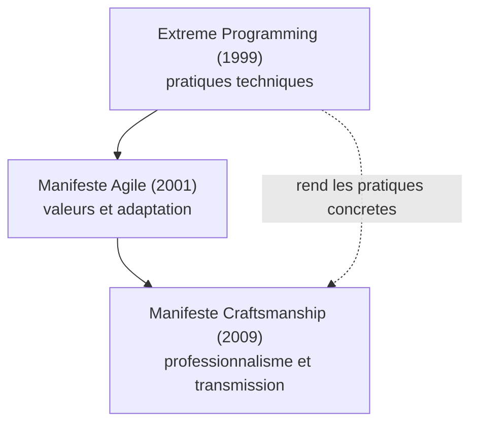
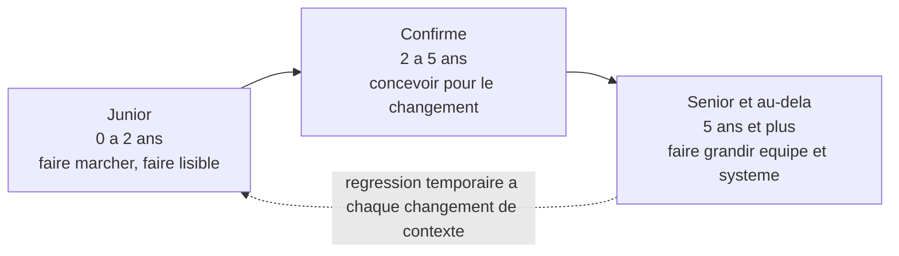

[↑ Sommaire](../README.md#table-des-matières) · [Le parcours en quatre étapes →](02-le-parcours-en-quatre-etapes.md)

# 1. Fondations et vocabulaire du craft

## Glossaire de référence

Le craft a son vocabulaire. Cette section sert de point d'ancrage : on peut y revenir dès qu'un terme rencontré plus loin reste flou. Chaque sigle est développé puis traduit.

- **TDD** (*Test-Driven Development*, développement piloté par les tests) : on écrit d'abord un test qui échoue, puis le code minimal pour le faire passer, puis on refactorise. Cycle red-green-refactor.
- **BDD** (*Behavior-Driven Development*, développement piloté par le comportement) : variante du TDD où les tests sont exprimés en langage naturel (Given / When / Then) pour rester proches du métier. Outils typiques : Cucumber, SpecFlow, Behat.
- **Refactoring** (refactorisation) : modifier la structure interne du code sans changer son comportement observable. Toujours sous filet de sécurité de tests.
- **Code review** (revue de code) : relecture d'un changement par un autre développeur avant intégration, sur une *Pull Request* ou *Merge Request*.
- **Pair programming** (programmation en binôme) : deux développeurs, un clavier, deux rôles (driver / navigator) qui s'échangent régulièrement.
- **Mob programming** (programmation en groupe) : la même chose à trois, quatre, cinq personnes ou plus. Une seule machine, le savoir circule.
- **Kata** : exercice de programmation court, répétable, dont l'enjeu n'est pas le résultat mais la *manière* de l'atteindre. Inspiré des arts martiaux japonais.
- **Dojo** (*coding dojo*) : séance collective où l'on pratique un kata ensemble, généralement en TDD strict, en pair ou en mob.
- **Rétro** (*retrospective*, rétrospective) : réunion de fin d'itération pour inspecter ce qui a marché, ce qui n'a pas marché, et décider d'une action d'amélioration.
- **Kaizen** (改善) : terme japonais désignant l'amélioration continue par petits pas. La rétro en est l'instrument.
- **Dette technique** (*technical debt*) : raccourci pris dans le code ou la conception qui facilite la livraison aujourd'hui mais coûte demain. Métaphore de Ward Cunningham (1992).
- **Definition of Done** (DoD, définition de fini) : liste de critères qu'une tâche doit satisfaire pour être considérée comme terminée. Tests verts, revue passée, documentation à jour, déployé, etc.
- **Story point** : unité d'estimation relative d'effort, de complexité et de risque. Pas une unité de temps. Sert à comparer des tâches entre elles, pas à promettre une date.
- **PR / MR** (*Pull Request* / *Merge Request*) : demande d'intégrer une branche dans une autre, ouverte sur la forge (GitHub utilise PR, GitLab utilise MR). Support de la revue de code.
- **CI** (*Continuous Integration*, intégration continue) : pratique consistant à fusionner et tester son travail dans le tronc commun plusieurs fois par jour, automatiquement.
- **CD** (*Continuous Delivery*, livraison continue) : prolongement de la CI où chaque commit produit un artefact déployable à tout moment. *Continuous Deployment* va plus loin : chaque commit qui passe la CI est automatiquement mis en production.
- **YAGNI** (*You Aren't Gonna Need It*) : ne pas implémenter ce qui n'est pas demandé maintenant.
- **DRY** (*Don't Repeat Yourself*) : chaque connaissance doit avoir une représentation unique, faisant autorité, dans le système.
- **KISS** (*Keep It Simple, Stupid*) : préférer la solution simple à la solution clever.
- **SOLID** : cinq principes de conception objet (Single responsibility, Open/closed, Liskov substitution, Interface segregation, Dependency inversion).
- **Code smell** (mauvaise odeur du code) : symptôme qui suggère un problème de conception sans le prouver. Inventaire chez Fowler.
- **Bounded context** (contexte délimité) : frontière à l'intérieur de laquelle un modèle de domaine a un sens cohérent et un vocabulaire stable. Concept central du DDD.
- **ADR** (*Architecture Decision Record*) : court document daté qui consigne une décision d'architecture, son contexte et ses conséquences.
- **XP** (*Extreme Programming*, programmation extrême) : méthode introduite par Kent Beck en 1999 dans *Extreme Programming Explained*. Pousse à l'extrême un faisceau de pratiques techniques (TDD, pair, refactoring, intégration continue, design simple, *small releases*). Parent direct du craftsmanship.
- **TDD-induced design damage** : expression de David Heinemeier Hansson (DHH, 2014) pour désigner les distorsions de conception introduites lorsqu'on optimise le code uniquement pour qu'il soit testable (multiplication des indirections, services anémiques, abus de mocks).
- **Test smell** (mauvaise odeur de test) : symptôme dans la suite de tests elle-même (test fragile, test obscur, test redondant, *mystery guest*). Catalogue chez Meszaros, *xUnit Test Patterns*.
- **NoEstimates** : mouvement initié par Vasco Duarte et Woody Zuill (2012-2014) qui propose de remplacer l'estimation par le découpage régulier en petites tranches livrables et la mesure du *throughput*.
- **Story point** déjà défini plus haut ; voir aussi *T-shirt sizing* (XS, S, M, L, XL) qui exprime le même esprit relatif sans chiffres.
- **Throughput** : nombre de tickets terminés par unité de temps. Métrique de flux préférée par les tenants du *NoEstimates*.
- **Mikado method** : technique de Daniel Brolund et Ola Ellnestam (*The Mikado Method*, 2014) pour mener un changement complexe par exploration et *backtracking*, en gardant le code compilable à chaque étape.
- **Tidy First** : terme de Kent Beck (*Tidy First?*, 2023) pour les micro-rangements préparatoires qu'on commit séparément avant un changement de comportement.
- **Strangler Fig** : voir section legacy. Patron de migration progressive popularisé par Martin Fowler en 2004.
- **Anti-corruption layer** : couche de traduction entre deux modèles, concept du DDD. Empêche les concepts d'un modèle pourri de polluer un modèle propre.
- **AABBCC** : grille mnémotechnique de revue de code (*Architecture, API, Bugs, Behaviour, Clarity, Coverage*). Voir section dédiée.
- **DORA** (*DevOps Research and Assessment*) : équipe de recherche dirigée par Nicole Forsgren, à l'origine des quatre métriques clés (*lead time*, *deployment frequency*, *MTTR*, *change failure rate*) et du rapport annuel *State of DevOps*.
- **DX** (*Developer Experience*, expérience développeur) : qualité ressentie du quotidien par celles et ceux qui produisent le logiciel. Indicateur indirect mais sérieux de la santé craft d'une organisation.

## Le Manifeste du Software Craftsmanship

Publié en 2009 par Robert C. Martin et un groupe de praticiens, le [Manifeste pour le Software Craftsmanship](https://manifesto.softwarecraftsmanship.org/) reprend la forme du [Manifeste Agile](https://agilemanifesto.org/iso/fr/manifesto.html) (2001) en lui ajoutant un quatrième niveau d'exigence.

> En tant qu'aspirants Software Craftsmen, nous augmentons la barre du développement professionnel de logiciel en pratiquant et en aidant les autres à apprendre le métier. À travers ce travail, nous en sommes venus à valoriser :
>
> Non seulement des logiciels qui fonctionnent, **mais aussi des logiciels bien conçus**.
> Non seulement l'adaptation aux changements, **mais aussi l'enrichissement constant de la valeur**.
> Non seulement les individus et leurs interactions, **mais aussi une communauté de professionnels**.
> Non seulement la collaboration avec le client, **mais aussi des partenariats productifs**.
>
> Ainsi, en recherchant les éléments de gauche, nous avons trouvé que ceux de droite sont indispensables.

> **Que veut dire « agile » et « Manifeste Agile » ?**
> L'agilité est une famille de méthodes de travail apparue dans les années 1990 et 2000, qui privilégie les petites livraisons fréquentes et l'adaptation au changement plutôt que les gros plans figés d'avance. Le Manifeste Agile (2001) en est le texte fondateur : quatre valeurs courtes signées par dix-sept praticiens. Comparaison du quotidien : préparer un repas en goûtant et corrigeant au fur et à mesure (agile), plutôt que suivre une recette à la lettre sans jamais goûter (méthode rigide).

**À retenir.** Le manifeste agile reste valable ; le craftsmanship en est une extension. Là où l'agile met l'accent sur la livraison de valeur et l'adaptation, le craft insiste sur la **manière** de livrer cette valeur : un code bien conçu, une communauté qui se forme, des partenariats au-delà de la transaction. Le craftsman ne s'oppose pas à l'agiliste, il refuse simplement le compromis « ça marche, tant pis pour le code », parce qu'un logiciel mal conçu coûte cher à chaque modification future.

**Différence clé avec l'Agile Manifesto.** Le Manifeste Agile parle d'efficacité et d'humain dans la livraison. Le Manifeste Craftsmanship parle du **professionnalisme du producteur** : qualité intrinsèque, transmission, durabilité. Les deux sont complémentaires, comme le montre leur filiation :

## Les racines XP : d'où vient le craft

Le craftsmanship n'est pas tombé du ciel en 2009. Il est l'enfant direct de l'**Extreme Programming** formalisé par Kent Beck en 1999 (*Extreme Programming Explained: Embrace Change*). XP a posé, avant tous les autres, l'idée qu'un faisceau de **pratiques techniques** (TDD, pair, refactoring, intégration continue, design simple, *small releases*, propriété collective du code) tient la qualité d'un logiciel autant que la posture humaine.

> **Que veulent dire « Scrum », « sprint », « daily stand-up » ?**
> Ce sont des rituels d'organisation venus de l'agilité. **Scrum** est la méthode agile la plus répandue : elle organise le travail en cycles courts. **Sprint** désigne l'un de ces cycles, en général deux semaines, à l'issue duquel l'équipe livre quelque chose d'utilisable. **Daily stand-up** (réunion debout quotidienne) est une réunion de quelques minutes, faite debout pour qu'elle reste courte, où chacun dit ce qu'il a fait, ce qu'il va faire et ce qui le bloque. Ces rituels organisent **quand** on travaille, pas **comment** on écrit le code.

Le Manifeste Agile (2001) a abstrait ce faisceau en valeurs et principes plus universels, plus communicables aux managers. La conséquence non voulue : la diffusion de l'agile a pu se faire **sans les pratiques techniques**. Beaucoup d'organisations « agiles » au sens des cérémonies (Scrum, sprints, *daily stand-up*) n'ont jamais adopté TDD, refactoring outillé ni livraison continue. C'est précisément ce vide que le manifeste de 2009 a voulu combler, car des rituels sans qualité technique produisent du logiciel livré vite mais difficile à faire évoluer.

**Lectures pour situer XP.**

- Kent Beck, *Extreme Programming Explained: Embrace Change* (1999, 2e édition 2004). Court, lumineux, encore actuel.
- Ron Jeffries, Ann Anderson, Chet Hendrickson, *Extreme Programming Installed* (2000). Le quotidien d'une équipe XP.
- Robert C. Martin, *Agile Software Development: Principles, Patterns, and Practices* (2002). La synthèse SOLID à la sortie d'XP.

À retenir : si quelqu'un présente le craft comme une mode récente, le sommaire d'*Extreme Programming Explained* suffit à le démentir. La majorité des pratiques décrites ici y figurent déjà. Le craftsmanship a, en plus, ajouté la **dimension communautaire** (apprentissage entre pairs, transmission, mouvement) qu'XP avait laissée à l'état d'usage local.

## Parcours junior, confirmé, senior

Un parcours réaliste s'étale sur plusieurs années, avec des paliers identifiables. Voici une cartographie indicative ; les durées varient selon le contexte, l'environnement et l'investissement personnel.

### Junior (0 à 2 ans)

**Mantra** : « je fais marcher, je fais lisible, je demande quand je bloque. »

- Lectures pivots : *The Pragmatic Programmer*, *Clean Code*.
- Pratiques : nommage soigné, fonctions courtes, tests unitaires sur du code neuf, premières revues de code à recevoir et à donner.
> **Que veulent dire « IDE » et « Git » ?**
> Un **IDE** (*Integrated Development Environment*, environnement de développement intégré) est le logiciel dans lequel on écrit le code : il combine un éditeur de texte, des outils pour exécuter et corriger le programme, et de l'assistance automatique (renommage, complétion). Exemples : IntelliJ IDEA, Visual Studio Code, PhpStorm. **Git** est un outil de gestion de versions : il enregistre l'historique de toutes les modifications du code, permet de revenir en arrière et de travailler à plusieurs sans s'écraser mutuellement. Comparaison du quotidien : Git est l'historique de modifications d'un document partagé, mais en beaucoup plus précis et fiable.

- Outils : maîtriser un IDE, Git en ligne de commande, un langage à fond plutôt que cinq survolés.
- Indicateurs de progression : vos PR passent la revue avec peu de remarques, vous savez expliquer un bug avant de le corriger.

### Confirmé (2 à 5 ans)

**Mantra** : « je conçois pour le changement, je teste avant, je laisse le code meilleur que je l'ai trouvé. »

- Lectures pivots : *Refactoring* (Fowler), *Working Effectively with Legacy Code* (Feathers), *Growing Object-Oriented Software* (Freeman & Pryce), *The Clean Coder*.
- Pratiques : TDD au quotidien, refactoring outillé, pair / mob, animation de katas internes, contribution à des décisions d'architecture documentées (ADR).
- Frontière typique : on devient *aller-chercheur* d'information sur un sujet flou, plutôt que d'attendre une spécification claire.
- Indicateurs : on vous confie la reprise de modules anciens, vous formulez des refus argumentés, vos estimations s'affinent.

### Senior et au-delà (5 ans et plus)

**Mantra** : « je fais grandir l'équipe et le système ; mon impact se mesure à ce qui tient sans moi. »

- Lectures pivots : *Domain-Driven Design* (Evans), *Implementing DDD* (Vernon), *Clean Architecture* (Martin), *Designing Data-Intensive Applications* (Kleppmann), *Accelerate* (Forsgren et al.), *Software Craftsmanship* (Mancuso), *Team Topologies* (Skelton & Pais).
- Pratiques : conception de systèmes, mentorat, animation de communautés, contribution à la stratégie technique, choix de compromis architecturaux assumés.
- Indicateurs : on vous sollicite pour arbitrer entre options techniques, vos écrits font référence dans l'équipe, des juniors progressent visiblement à votre contact.

> **Que veut dire « stack » ?**
> Une *stack* (pile technologique) est l'ensemble des technologies utilisées pour construire une application : le langage de programmation, le cadre logiciel (*framework*), la base de données, les outils. Comparaison du quotidien : un cuisinier maîtrise des ustensiles et des techniques précis ; changer de cuisine (française vers japonaise) le force à réapprendre des gestes, même s'il reste un bon cuisinier.

Le passage d'un palier à l'autre n'est pas linéaire. On régresse temporairement chaque fois qu'on change de stack, de domaine ou de contexte. C'est normal : les réflexes acquis sont liés à un environnement précis et doivent être reconstruits ailleurs.

### Honnêteté sur la progression : tout le monde n'est pas staff

> **Que veulent dire « staff », « principal », « distinguished » ?**
> Ce sont des titres de carrière d'ingénieur au-delà de « senior », pour celles et ceux qui veulent prendre plus de responsabilité technique sans devenir managers (encadrants de personnes). Du plus accessible au plus rare : **staff engineer** (impact sur plusieurs équipes), **principal engineer** (impact à l'échelle de l'entreprise), **distinguished engineer** (figure de référence, très rare). Comparaison du quotidien : ce sont des grades, comme les ceintures en arts martiaux, mais le grade ne garantit pas la maîtrise réelle.

L'industrie parle beaucoup des trajectoires *staff / principal / distinguished*. Elles existent, elles sont légitimes, et elles attirent les projecteurs. Mais elles ne sont **ni le seul horizon, ni le plus enviable**.

Beaucoup d'excellents praticiens **restent toute leur carrière à un niveau « senior »** au sens technique, par choix lucide. Ils approfondissent un domaine (paiement, télémétrie, compilateurs, données géographiques) et deviennent la mémoire et la maîtrise d'une équipe ou d'un produit. Leur impact se mesure à la **profondeur**, pas à la largeur. C'est une voie pleinement craft : Sandi Metz a écrit l'essentiel de son œuvre en restant développeuse senior ; Emily Bache enseigne le TDD sans être *staff* d'aucune mégastructure ; Michael Feathers a façonné notre rapport au legacy sans titre nobiliaire technique.

> **Que veut dire « flow » ?**
> Le *flow* (état de flux) est l'état de concentration profonde où l'on est absorbé par une tâche, productif et sans distraction. Le psychologue Mihály Csíkszentmihályi l'a décrit. Comparaison du quotidien : le moment où l'on est tellement plongé dans un livre passionnant qu'on oublie l'heure. Les réunions fréquentes cassent cet état, qui demande de longues plages ininterrompues pour s'installer.

L'erreur courante chez les *staff aspirants* : croire que monter d'un titre, c'est gagner en sens. Souvent, c'est gagner en réunions et perdre en *flow*. Le bon repère :

- **Ce qui me rend le plus utile aujourd'hui à mon équipe et à mon produit, est-ce d'écrire du code, de mentorer, d'arbitrer, d'animer une communauté ?** La réponse honnête vous dit votre prochaine marche, indépendamment de la grille de l'entreprise.
- **Une trajectoire latérale (autre domaine, autre contexte) vaut souvent une trajectoire ascendante.** Le craftsman qui passe d'un éditeur de logiciel à une administration publique, ou d'un grand groupe à une coopérative, apprend autant qu'un changement de titre.
- **Un titre supérieur sans la maîtrise associée est une promesse non tenue.** Le « senior à 18 mois » et le « staff par négociation » sont des versions du même piège. Mieux vaut être un excellent senior qu'un staff d'apparence.

Cette honnêteté est rare dans la littérature carrière. Elle est pourtant au cœur du craft : on cherche la maîtrise, pas le titre.

---

[↑ Sommaire](../README.md#table-des-matières) · [Le parcours en quatre étapes →](02-le-parcours-en-quatre-etapes.md)
