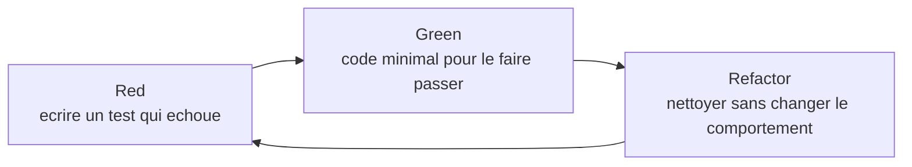
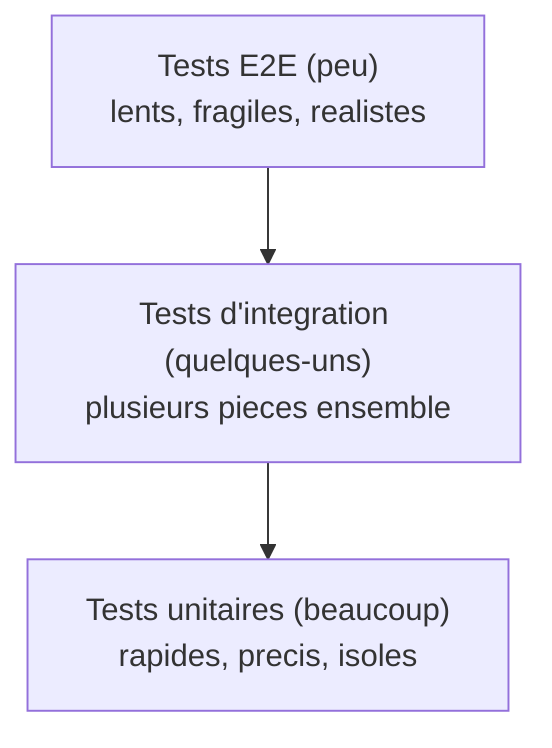

[← Le parcours en quatre étapes](02-le-parcours-en-quatre-etapes.md) · [↑ Sommaire](../README.md#table-des-matières) · [Refactoring et katas →](04-refactoring-et-katas.md)

# 3. Le Test-Driven Development en profondeur

## Test-Driven Development en profondeur

Le TDD est plus qu'une technique de test : c'est une **boucle de feedback de conception**. Le test n'est pas la fin ; il est la pression qui pousse vers un code mieux découpé.

> **Avertissement craft.** Le red-green-refactor est un *moyen*, pas une cérémonie. Le but du test n'est ni de vous faire afficher un badge vert, ni de remplir un quota de couverture, ni de ressembler à un kata bien fait. Le but est d'**obtenir un retour rapide et juste** sur la conception et le comportement. Si vous récitez le cycle sans en sentir la pression, c'est du TDD-théâtre.

> **Refactor sous filet, jamais sans.** La phase 3 du cycle suppose que vous avez une suite de tests qui dit la vérité, vite. Sans ce filet, ce que vous appelez « refactoring » est en réalité une **réécriture à risques**. Le craftsman qui modifie une structure sans test fiable au préalable n'est pas en train de refactorer ; il bricole en pariant sur sa mémoire. Si le filet n'existe pas, on commence par le tisser (caractérisation, *seams*, sprout). Ce n'est pas négociable.

### Le cycle red-green-refactor

> **Que veut dire « red-green-refactor » ?**
> C'est le rythme en trois temps du TDD, nommé d'après la couleur qu'affiche l'outil de test. **Red** (rouge) : on écrit d'abord un test, il échoue car le code n'existe pas encore, l'outil affiche rouge. **Green** (vert) : on écrit le minimum de code pour que le test passe, l'outil affiche vert. **Refactor** (refactoriser) : on nettoie le code sans changer ce qu'il fait, en gardant le vert. Comparaison du quotidien : poser d'abord la barre à franchir (rouge), sauter juste assez haut pour la passer (vert), puis soigner son geste (refactor).

1. **Red** : écrire un test qui échoue. Si le test passe du premier coup, c'est qu'il ne testait pas grand-chose.
2. **Green** : écrire le code minimum pour faire passer le test. *Fake it till you make it.* On a le droit d'écrire le code le plus moche possible à cette étape.
3. **Refactor** : nettoyer le code et les tests, **sans ajouter de comportement**. Les tests verts sont le filet.

Trois lois de Robert Martin :
- ne pas écrire de code de production sans test rouge qui l'exige ;
- ne pas écrire plus de test qu'il n'en faut pour échouer (la non-compilation compte) ;
- ne pas écrire plus de code de production qu'il n'en faut pour passer.

### Deux écoles : Chicago (classicist) et London (mockist)

Les deux écoles sont valides. Les connaître permet de faire un choix conscient selon le contexte.

**École classique (dite « Chicago », ou « state-based »).** On part d'un test de bout en bout, on construit les objets réels au fil du test, on vérifie l'état après l'action. Le test connaît peu la structure interne. Refactoriser la structure ne casse pas les tests tant que le comportement public est stable. Référence : Kent Beck, *Test Driven Development: By Example*. Convient aux algorithmes, aux objets-valeurs, aux modèles de domaine purs.

> **Que veulent dire « mock », « objet-valeur », « état » ?**
> Un **mock** (objet simulé) est une doublure de test programmée pour vérifier qu'on l'a bien appelée comme prévu (par exemple : « le service d'envoi d'e-mail a-t-il bien été appelé une fois ? »). Un **objet-valeur** (*value object*) est un petit objet défini uniquement par ses données, sans identité propre, par exemple une somme d'argent ou une adresse e-mail : deux objets identiques sont interchangeables, comme deux pièces de un euro. L'**état** (*state*) est l'ensemble des valeurs que contient un objet à un instant donné ; un test « basé sur l'état » vérifie ces valeurs après l'action, tandis qu'un test « basé sur l'interaction » vérifie quels appels ont eu lieu.

**École londonienne (dite « mockist », ou « interaction-based »).** On part de l'extérieur, on dirige la conception par les collaborations entre objets, on remplace les collaborateurs par des *mocks* qui vérifient les interactions. Référence : Steve Freeman et Nat Pryce, *Growing Object-Oriented Software, Guided by Tests*. Convient aux objets de service, aux orchestrations, aux frontières (HTTP, queues, base de données).

**Comment choisir ?** Pour un cœur de domaine riche et stable, préférer le style Chicago : les tests survivent aux refactos. Pour un service applicatif qui orchestre des collaborateurs, le style Londres documente mieux les contrats. La plupart des codebases mûres mélangent les deux, sans complexe.

### Les tests comme feedback de conception

Si écrire un test est douloureux, le test vous dit quelque chose : trop de dépendances, trop de responsabilités, état caché, couplage. Le réflexe craft : ne pas combattre le test, écouter ce qu'il dénonce et redescendre dans le code.

### Pyramide ou trophée

> **Que veulent dire « test unitaire », « test d'intégration », « E2E » ?**
> Un **test unitaire** vérifie un tout petit morceau de code isolé (une fonction, une classe). Il est rapide et précis. Un **test d'intégration** vérifie que plusieurs morceaux fonctionnent ensemble (par exemple le code et la vraie base de données). Un test **E2E** (*end to end*, de bout en bout) imite un utilisateur réel qui traverse toute l'application, du clic jusqu'au résultat affiché. Comparaison du quotidien : pour une voiture, le test unitaire vérifie une bougie, l'intégration vérifie que le moteur tourne, le E2E vérifie qu'on peut faire le tour du pâté de maisons.

La pyramide classique de Mike Cohn (beaucoup d'unitaires, quelques intégration, peu de bout-en-bout) reste un bon point de départ : les tests rapides et précis sont nombreux, les tests lents et fragiles sont rares.

Pour les applications web modernes, Kent C. Dodds propose le *testing trophy* (statique, unitaire, intégration, E2E) : la couche d'intégration y prend plus d'importance, parce qu'elle attrape les bugs là où les morceaux se rencontrent. Le bon dosage dépend du coût d'exécution et de la fiabilité des tests dans votre contexte. Le critère qui compte : un test qui échoue parle vite, et il parle juste.

## Le côté sombre du TDD : sur-tester et abîmer la conception

Le TDD a aussi ses dérives. Les ignorer, c'est s'exposer à les vivre sans les comprendre.

### Le débat « TDD is dead » (2014)

En avril 2014, **David Heinemeier Hansson** (créateur de Ruby on Rails) publie *TDD is dead. Long live testing.* Il y dénonce une dérive : à force de chercher la testabilité, on multiplie les indirections, on extrait des classes uniquement pour pouvoir les *mocker*, on fragmente le domaine en services anémiques. Il forge l'expression **« TDD-induced design damage »** : des dégâts de conception causés par le souci de tester.

> **Que veulent dire « indirection », « service anémique », « testabilité » ?**
> Une **indirection** est une couche intermédiaire ajoutée entre deux parties du code : au lieu d'appeler directement B, A passe par un intermédiaire. Un peu d'indirection assouplit le code ; trop le rend labyrinthique, car il faut sauter de fichier en fichier pour suivre une simple action. Un **service anémique** est un objet vidé de sa logique métier, réduit à transporter des données d'un endroit à l'autre, ce qui éparpille les vraies règles ailleurs. La **testabilité** est la facilité avec laquelle on peut écrire des tests sur un code : un code difficile à tester révèle souvent un défaut de conception (trop de dépendances enchevêtrées).

La même année, **Kent Beck**, **Martin Fowler** et **DHH** tiennent une série de conversations en visio (*Is TDD Dead?*, six épisodes, 2014). Beck nuance : le TDD reste un excellent outil, mais ce n'est ni une obligation morale ni la seule manière d'écrire du bon code. Fowler ajoute que **la testabilité est un indicateur de couplage**, pas une fin en soi. La conclusion implicite des trois : appliquez le TDD avec discernement, pas par dévotion.

Lectures et écoutes :

- David Heinemeier Hansson, [*TDD is dead. Long live testing.*](https://dhh.dk/2014/tdd-is-dead-long-live-testing.html) (2014).
- Kent Beck, Martin Fowler, DHH, [*Is TDD Dead?*](https://martinfowler.com/articles/is-tdd-dead/), série de conversations (2014).

### Quand les tests deviennent une dette

Une suite de tests **mal pensée** finit par coûter plus cher qu'elle ne rapporte. Symptômes :

- **Tests fragiles** qui cassent à chaque renommage interne, même quand le comportement est inchangé.
- **Mocks qui spécifient l'implémentation** au lieu de vérifier le comportement : le test devient un miroir du code, pas un garde-fou.
- **Couverture obsessive** : on teste les *getters*, les *setters*, les concaténations triviales, et la suite met dix minutes pour rien.
- **Tests obscurs** : le lecteur ne comprend pas quel comportement est vérifié, ni pourquoi il est censé tenir. *Mystery guest*, *eager test*, *assertion roulette* : voir le catalogue de Meszaros.
- **Tests dupliqués** : la même règle métier vérifiée à dix endroits, par cinq mécanismes différents. Toute évolution coûte dix corrections de tests.

### Heuristiques pour ne pas sur-tester

- **Testez le comportement, pas l'implémentation.** Si un test casse parce qu'on a renommé une variable privée, il testait la mauvaise chose.
- **Une règle métier mérite un test ; un détail technique en mérite rarement un.** Le formatage d'une date dans une vue n'a pas besoin d'un test unitaire si un test d'intégration le couvre.
- **Préférez peu de tests qui parlent à beaucoup de tests qui crient.** Une suite trop bruyante est ignorée.
- **Mesurez ce qui coûte la suite de tests** : durée, instabilité (*flakiness*), taux d'échec sur changements bénins. Si l'un de ces indicateurs dérive, c'est un signal de refonte de la suite.
- **Acceptez que certains modules ne valent pas le TDD.** Glue code, scripts d'administration, prototype à durée de vie connue : un test de sortie attendue ou une démo manuelle suffit. Le TDD est un outil ; comme tout outil, il a un domaine d'usage.

### La position craft mature

Le TDD reste un acquis du métier. Mais le craftsman expérimenté **n'écrit pas un test pour chaque ligne** ; il écrit un test pour **chaque comportement qu'il veut figer ou découvrir**. Il accepte de supprimer un test devenu redondant. Il sait reconnaître un test qui dicte la conception de manière néfaste, et il a le courage de le retirer. Le but n'est pas la couverture maximale ; c'est la **confiance maximale par test minimal**.

---

[← Le parcours en quatre étapes](02-le-parcours-en-quatre-etapes.md) · [↑ Sommaire](../README.md#table-des-matières) · [Refactoring et katas →](04-refactoring-et-katas.md)
