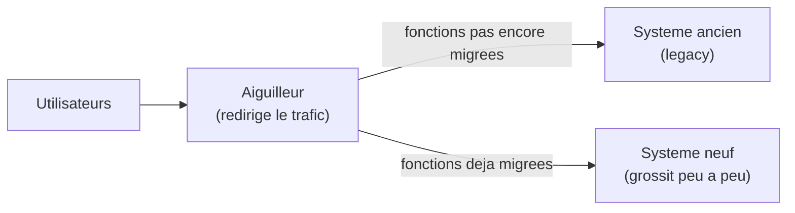

[← Collaborer : binôme, groupe, revue et estimation](05-collaborer-binome-groupe-revue-et-estimation.md) · [↑ Sommaire](../README.md#table-des-matières) · [Livraison continue, mentorat et carrière →](07-livraison-continue-mentorat-et-carriere.md)

# 6. Travailler avec le code legacy

## Travailler avec du code legacy

Pour Michael Feathers, est *legacy* tout code **sans tests automatiques**. Pas tout code ancien : un code de 2010 bien testé est plus sain qu'un microservice écrit hier sans tests.

### Caractérisation : le filet avant la lame

Le **test de caractérisation** (*characterization test*, parfois *golden master*) ne vérifie pas un comportement attendu, il **fige le comportement actuel**, qu'il soit juste ou non. Mécanique :

1. Choisir un point d'entrée à isoler.
2. Lui donner une entrée.
3. Capturer la sortie observée.
4. Écrire un test qui assert sur cette sortie.
5. Itérer pour augmenter la couverture jusqu'à pouvoir refactorer sereinement.

C'est désagréable parce qu'on enchâsse même des bugs. C'est précieux parce que le filet existe avant qu'on touche au code. Une fois les tests verts, on peut refactorer ; on remplacera ensuite les tests de caractérisation par de vrais tests de comportement.

### Les *seams* (coutures)

Concept central de Feathers : une *seam* est un endroit où l'on peut **changer de comportement sans modifier le code** (par injection, héritage, lien dynamique, etc.). Identifier les seams permet d'introduire des doublures de test sans tout réécrire.

> **Que veulent dire « injection de dépendance » et « héritage » ?**
> L'**injection de dépendance** consiste à fournir à un objet les outils dont il a besoin depuis l'extérieur, au lieu qu'il les fabrique lui-même. Comparaison du quotidien : on tend une perceuse au bricoleur (injection) plutôt que de le forcer à construire sa propre perceuse. En test, on peut alors lui « injecter » une fausse perceuse silencieuse. L'**héritage** est un mécanisme orienté objet où une classe « fille » récupère et spécialise le comportement d'une classe « mère » ; par exemple `Chat` hérite de `Animal` et ajoute « miauler ».

### Sprout method / Sprout class

Plutôt que d'éditer une grosse fonction non testée, **on lui greffe** une nouvelle méthode (ou classe) **bien testée**, et la fonction d'origine appelle cette greffe. Le code neuf est propre, le code ancien reste isolé. Avec le temps, la greffe grossit, l'ancien rétrécit.

### Wrap method / Wrap class

On *enveloppe* un appel existant : la méthode publique change de nom, on en crée une nouvelle qui appelle l'ancienne plus une logique additionnelle. Permet d'ajouter du comportement (logging, métriques, validation) sans toucher au cœur risqué.

### Strangler Fig (figuier étrangleur)

Patron popularisé par Martin Fowler en 2004, sur la métaphore du figuier qui pousse autour de son hôte et finit par le remplacer. On ne réécrit pas le système legacy ; on **construit le nouveau autour**, on bascule trafic et fonctionnalités progressivement, jusqu'à pouvoir éteindre l'ancien. Convient aux migrations lourdes, sans *big bang* (la réécriture totale d'un coup, qu'on bascule en une seule fois, approche risquée car tout casse en même temps).

### Anti-corruption layer (couche anti-corruption)

DDD. Quand un nouveau modèle doit interagir avec un legacy mal modélisé, on insère une couche de traduction qui empêche les concepts pourris de remonter dans le neuf. C'est une frontière, et elle est volontairement ennuyeuse.

### Heuristiques quotidiennes

- **Règle du boy-scout** : laisser le code un peu meilleur qu'on ne l'a trouvé. Un nom, une extraction, un test ; pas de grand soir.
- **Mikado method** : pour un changement complexe, on tente le changement, on note ce qui résiste, on backtrack, on s'attaque aux dépendances en partant des feuilles. Permet de garder le code compilable et testable à chaque pas.
- **Refuser la réécriture totale**. Joel Spolsky, Things You Should Never Do, Part I (2000) : la réécriture est presque toujours plus longue que prévu et perd tout l'apprentissage capté dans le legacy.

## Petits pas en territoire legacy : éviter la paralysie d'analyse

Mikado, sprout, anti-corruption layer, *characterization tests* : tous ces outils sont précieux. Ils peuvent aussi devenir des **prétextes à ne rien faire** quand on les applique à grande maille. Le piège classique : passer trois semaines à cartographier l'ancien système avant d'oser y poser le moindre changement. Le craftsman aguerri résiste à cette tentation.

### Le principe du plus petit pas testable

À chaque instant, **demandez-vous quel est le plus petit pas qui :**

1. **Apporte une amélioration concrète** (un test ajouté, un nom clarifié, une dépendance brisée, une régression couverte).
2. **Laisse le code dans un état compilable et testable** (la suite tourne, on peut commiter).
3. **Tient en moins d'une heure** de travail effectif.

Si votre prochain pas ne tient pas dans ces trois contraintes, il est trop gros. Découpez-le. Cela paraît trivial ; en pratique, c'est ce qui sépare une refonte legacy qui aboutit d'une qui s'enlise.

### Time-boxer l'exploration

Le legacy invite à l'exploration sans fin : « j'aimerais comprendre toute cette zone avant de toucher quelque chose ». La discipline craft consiste à **borner cette exploration** :

- **Spike** : une à deux journées, pas plus, pour comprendre une zone. À la sortie, soit on a un plan d'attaque concret, soit on documente ce qu'on a appris et on recommence dans un autre angle.
- **Mikado en *time-box*** : on note les obstacles rencontrés, on revient au point de départ, on attaque les feuilles de l'arbre de dépendances. Si après une journée le mikado n'a pas avancé, c'est qu'il faut redécouper.
- **Refacto incrémentale, pas refonte programmée**. Un refacto qui demande « toute une semaine sans livraison » est presque toujours un signe de mauvais découpage. Le craftsman ré-architecture **sans interrompre la livraison**.

### Heuristiques pour ne pas s'enliser

- **Garder la suite verte à chaque commit.** Pas de longue branche en chantier sans repère.
- **Commit par étape**, avec un message qui dit l'intention. Un *git log* de refacto bien fait raconte une histoire.
- **Demander de l'aide tôt.** Trois jours bloqué seul sur un legacy n'est pas du courage, c'est de l'orgueil. Une heure de pair débloque souvent ce qui résistait à trois jours de solo.
- **Définir un critère d'arrêt avant de commencer.** « Je m'arrête quand le module *X* est sous tests à 80 % » est un critère. « Je m'arrête quand le code est propre » n'en est pas un.
- **Accepter de laisser du sale.** On rend le module *meilleur*, pas *parfait*. Le craftsman expérimenté sait s'arrêter au bon moment et passer au suivant.

### Le piège des grands plans

Un plan de refonte sur six mois, avec roadmap, jalons et phases nommées, est presque toujours une fiction. Le legacy résiste de manière non linéaire ; un plan rigide se heurte à des obstacles imprévus, et l'équipe perd la foi. À la place : un cap clair (où veut-on aller dans deux ans ?), un *backlog* de petits pas (qu'est-ce qu'on fait cette semaine ?), une rétrospective fréquente sur la trajectoire (qu'a-t-on appris qui change le cap ?).

Le mieux est l'ennemi du bien, et la planification parfaite est l'ennemie de la livraison.

---

[← Collaborer : binôme, groupe, revue et estimation](05-collaborer-binome-groupe-revue-et-estimation.md) · [↑ Sommaire](../README.md#table-des-matières) · [Livraison continue, mentorat et carrière →](07-livraison-continue-mentorat-et-carriere.md)
