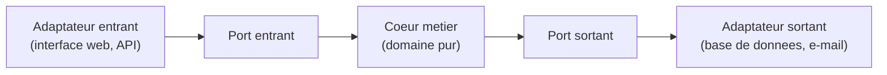
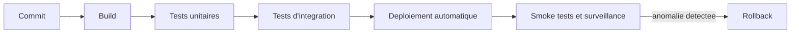

[← Travailler avec le code legacy](06-travailler-avec-le-code-legacy.md) · [↑ Sommaire](../README.md#table-des-matières) · [Soutenabilité, communauté et pratique quotidienne →](08-soutenabilite-communaute-et-pratique-quotidienne.md)

# 7. Livraison continue, mentorat et carrière

## Continuous Delivery comme aboutissement du craft

Le craftsmanship culmine, en environnement professionnel, dans la **livraison continue**. Ce n'est pas un sujet « DevOps » à part : c'est la conséquence directe de toutes les pratiques craft mises bout à bout.

### Pourquoi le craft mène mécaniquement à la CD

- Si vous écrivez des **tests automatisés** rapides et fiables, vous pouvez tester chaque commit en CI. Sans ça, la CI n'est qu'une cérémonie.
- Si vous **refactorez en continu**, le code reste dans un état propre, ce qui rend les déploiements moins risqués.
- Si vous **livrez par petits incréments**, la taille des changements diminue, ce qui réduit la probabilité de panne.
- Si vous **codez avec des frontières claires** (couches, *bounded contexts*, ports/adapters), vous pouvez déployer indépendamment ce qui est indépendant.
- Si vous **maîtrisez les feature flags**, vous pouvez fusionner souvent sans exposer ce qui n'est pas fini.

> **Que veulent dire « port / adaptateur » et « feature flag » ?**
> Le couple **port / adaptateur** (cœur de l'architecture dite hexagonale) sépare le cœur métier du monde extérieur. Un **port** est une prise standardisée définie par le métier (« j'ai besoin de sauvegarder une commande »), sans dire comment. Un **adaptateur** est la fiche qui se branche sur cette prise et réalise le « comment » concret (sauver dans une base PostgreSQL, dans un fichier, ailleurs). Comparaison du quotidien : une prise électrique murale est un port ; le chargeur qu'on y branche est un adaptateur, interchangeable sans toucher au mur. On peut ainsi remplacer la base de données sans réécrire le métier. Un **feature flag** (drapeau de fonctionnalité) est un interrupteur dans le code qui active ou désactive une fonctionnalité sans redéployer : on peut livrer du code éteint, puis l'allumer plus tard, pour quelques utilisateurs d'abord.

L'inverse est vrai : une équipe qui prétend faire du craft mais qui livre une fois par mois en grosse fournée a, quelque part, un mensonge qu'elle se raconte.

### Les quatre métriques DORA

Les métriques publiées dans *Accelerate* (Forsgren, Humble, Kim, 2018) restent la meilleure boussole partagée :

- **Lead time for changes** : du commit à la production, combien de temps ?
- **Deployment frequency** : à quelle fréquence livre-t-on en production ?
- **Change failure rate** : quelle proportion des déploiements provoque un incident ?
- **Mean time to restore** : combien de temps pour revenir à la normale après incident ?

Les organisations qualifiées d'*élite* livrent **plusieurs fois par jour**, avec un *change failure rate* sous 15 %, et un *MTTR* sous une heure. Les *low performers* livrent moins d'une fois par mois avec un *change failure rate* au-dessus de 45 %. L'écart est colossal, et il se construit pratique par pratique.

### Le rapport au lot (*batch size*)

L'idée centrale de la CD, héritée du *lean* et formalisée par Humble et Farley, est que **plus le lot est petit, plus le système est sain** : moins de risque par déploiement, retour utilisateur plus rapide, capacité à corriger immédiatement. Le craftsman lutte contre tout ce qui grossit le lot : grosses PR, branches longues, fenêtres de déploiement rares, *release notes* à rallonge.

### Pratiques structurantes

> **Que veulent dire « branche », « trunk-based », « smoke test », « canary », « rollback » ?**
> Une **branche** Git est une copie de travail parallèle où l'on développe une fonctionnalité sans perturber le code principal, avant de la fusionner. Le **trunk-based development** (développement sur le tronc) consiste à travailler sur des branches très courtes et à fusionner dans la branche principale plusieurs fois par jour, pour éviter les écarts qui s'accumulent. Un **smoke test** (test de fumée) est une vérification rapide après déploiement que l'essentiel fonctionne (l'expression vient de l'électronique : on branche, et si ça fume, on arrête). Le **canary** (canari) est une mise en service progressive sur une petite fraction d'utilisateurs avant de généraliser, du nom du canari descendu dans les mines pour détecter le danger en premier. Le **rollback** (retour arrière) consiste à revenir à la version précédente quand la nouvelle pose problème.

- **Trunk-based development** ou *short-lived feature branches* : la branche principale est intégrable à tout moment.
- **Pipeline de déploiement** outillé : commit, build, tests unitaires, tests d'intégration, déploiement automatique en environnements successifs.
- **Feature flags** pour découpler la livraison du code de l'activation de la fonctionnalité.
- **Tests post-déploiement** : *smoke tests*, *canary*, surveillance des métriques applicatives.
- **Rollback automatisé** ou *forward fix* rapide en cas d'anomalie.
- **Postmortems sans blâme** (modèle SRE Google) après chaque incident significatif.

Lectures :

- Jez Humble, David Farley, *Continuous Delivery* (2010).
- Nicole Forsgren, Jez Humble, Gene Kim, *Accelerate* (2018).
- Dave Farley, *Modern Software Engineering* (2021).
- Charity Majors, *Observability Engineering* (2022, avec Liz Fong-Jones et George Miranda).

Le craftsman qui ne s'intéresse pas à la livraison continue **passe à côté de la moitié de son métier**. Le code qui ne tourne pas en production n'a pas encore créé de valeur ; et le code qui tourne en production sans qu'on sache comment, ni quand, ni avec quel impact, est une bombe à retardement.

## Mentorat : enseigner est un métier en soi

Le craftsmanship met la **transmission** au cœur du métier (« en aidant les autres à apprendre le métier »). Mentorer n'est pas une simple gentillesse en marge du « vrai travail » : c'est une compétence à part entière, qu'on apprend, qu'on rate, qu'on raffine.

### Les quatre erreurs classiques du mentor débutant

- **Faire à la place de**. On voit le mentoré galérer, on attrape le clavier « pour gagner du temps ». Résultat : le mentoré n'apprend pas, il regarde. C'est la version *adulte* d'un parent qui fait les devoirs de son enfant.
- **Corriger à voix haute** chaque écart. Le mentoré ne pratique plus, il subit. Il apprend à éviter le mentor plutôt qu'à progresser.
- **Tout expliquer en une fois**. Le débutant n'a de la place mentale que pour deux ou trois idées par séance. Le reste glisse.
- **Mesurer la progression au rythme du mentor**, pas à celui du mentoré. On finit par lui en vouloir d'être lent. C'est une faute du mentor, pas de l'apprenti.

### Quelques techniques qui marchent

- **Démontrer puis céder le clavier**. « Regarde, je commence un test, j'écris cette assertion. À toi de continuer le suivant. » L'imitation guidée est très puissante.
- **Poser plus de questions que vous ne donnez de réponses.** « Que se passe-t-il si l'entrée est vide ? » fait travailler ; « il faut ajouter un *if null* » fait subir.
- **Donner du feedback selon la règle « *fact, impact, request* »** : « Quand tu pousses sans relire (*fact*), tu introduis des typos qui font perdre du temps en revue (*impact*) ; relis-toi avant de pousser (*request*). » Précis, factuel, actionnable.
- **Célébrer les progrès**, même petits. Une victoire reconnue ancre l'apprentissage. « Ton nommage s'est nettement amélioré sur cette PR » vaut une heure de cours.
- **Accepter le silence après une question**. Laissez deux ou trois secondes au mentoré pour réfléchir avant de remplir le vide. La pause est productive.
- **Faire vivre l'erreur**, plutôt que la prévenir systématiquement. Une bogue rencontrée et résolue ensemble enseigne plus que dix avertissements préventifs.

### Mentorat structuré

- **Format binôme régulier** (« 1:1 craft ») : 30 à 45 minutes par semaine ou par quinzaine, agenda partagé. Le mentoré pose les sujets ; le mentor écoute, suggère, ouvre des portes.
- **Pair programming planifié** : une à deux séances par semaine, sur du code réel. Le pair guidé est l'école la plus rapide qui existe.
- **Dojo interne** : un kata mensuel animé en mob. Permet aux juniors de pratiquer en environnement protégé.
- **Programme d'apprentissage de la London Software Craftsmanship Community** (Sandro Mancuso, *The Software Craftsman*, chap. 12-13) : *apprenticeships* formels de plusieurs mois, avec mentor désigné et objectifs explicites.

### Mentorer, c'est aussi savoir refuser

- Refuser de mentorer quelqu'un qu'on n'a ni le temps ni l'énergie d'accompagner. Mentor à moitié ne vaut rien.
- Refuser un mentorat qui devient parasitaire (un mentoré qui veut être nourri en réponses sans pratiquer). Le mentor n'est pas un *Stack Overflow* humain.
- Refuser de devenir le seul recours du mentoré : un bon mentor envoie son apprenti vers d'autres mentors, d'autres communautés, d'autres pratiques. La diversité de modèles vaut mille fois la fidélité à un seul.

Lectures :

- Sandro Mancuso, *The Software Craftsman* (2014), chapitres sur *apprenticeship* et *journeyman*.
- Camille Fournier, *The Manager's Path* (2017), particulièrement les chapitres sur le *mentoring* et le *tech lead*.
- Lara Hogan, *Resilient Management* (2019).
- Andy Grove, *High Output Management* (1983, encore actuel).

## Évolution de carrière du craftsman

Le craft n'oblige pas à devenir manager. Il y a au moins deux trajectoires.

### Le développeur en T (T-shaped)

Profondeur sur un domaine ou une stack, **largeur sur les sujets adjacents** : produit, ops, data, sécurité. Le T se construit en cinq à dix ans par exposition volontaire à des sujets connexes (rotations, side projects, contributions open source).

### Le leadership technique sans management

Le craft a forgé une voie distincte de l'ascension hiérarchique :

- **Tech lead** : porte la qualité technique d'une équipe, sans encadrer formellement les personnes. Anime, mentore, arbitre les compromis.
- **Staff engineer** : impact transverse à plusieurs équipes. Référence : *Staff Engineer: Leadership beyond the management track*, Will Larson.
- **Principal engineer** : impact à l'échelle de l'organisation, parfois de l'industrie. Architecture stratégique, R&D, choix technologiques majeurs.
- **Distinguished engineer** : très rare, généralement réservé aux grandes structures.

Ces titres ne sont pas universels ; chaque entreprise les définit. Ce qui importe, c'est la **levier** : à quel point votre travail rend les autres meilleurs ? Plus l'impact est large, plus on monte sur cette trajectoire.

### Trajectoire managériale

Compatible avec le craft. Le bon manager technique reste légitime sur le code parce qu'il en lit, en écrit (peu mais régulièrement), et garde le respect des praticiens. Lectures utiles : *The Manager's Path* de Camille Fournier, *An Elegant Puzzle* de Will Larson.

### Lectures pour penser sa carrière

- *Software Craftsmanship*, Sandro Mancuso (manifeste vivant).
- *The Pragmatic Programmer*, Hunt & Thomas (toujours).
- *A Philosophy of Software Design*, John Ousterhout (synthèse moderne).
- *Staff Engineer*, Will Larson.
- *The Manager's Path*, Camille Fournier (pour comprendre l'autre voie, même si on ne la prend pas).

---

[← Travailler avec le code legacy](06-travailler-avec-le-code-legacy.md) · [↑ Sommaire](../README.md#table-des-matières) · [Soutenabilité, communauté et pratique quotidienne →](08-soutenabilite-communaute-et-pratique-quotidienne.md)
